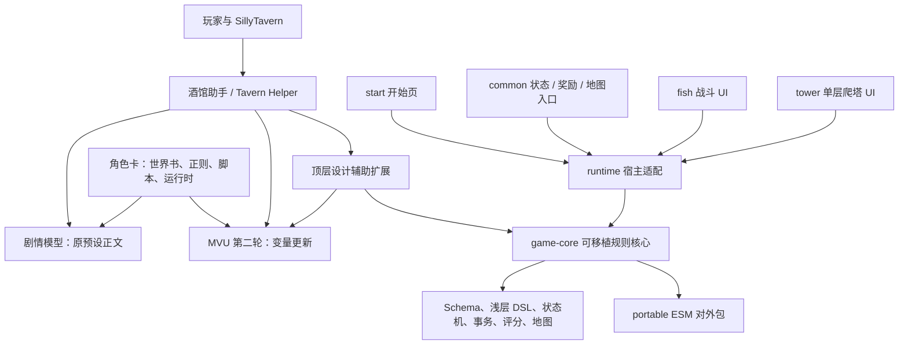

> **2026-09-22 流派与评分审查完成（未修改运行时）**：核对 67 个流派节点、138 个基础预设及静态/影子/正式引擎评分调用链。26 个合法合成包复现缓存 ID 碰撞、词条漏识别、目标/因果误判、基础牌阈值跳变、无关状态加分和敌人周期/被动估分偏差；96 次正式引擎试打证实无伤害欲望循环可在 0 胜时取得 100% 表现分。8 组现有回归通过；新增诊断脚本和分阶段方案，缺陷尚待修复。未重建/安装、刷新页面、触碰存档或调用模型，当前测试卡保持下条记录。详见 [审查、复现与方案](tasks/2026-09-22-archetype-scoring-audit.md)。

> **2026-09-22 剧情删牌与战后结算修复已本地安装（当前入口）**：源码 `16c11fc`，候选 `story-ui-20260922-r1`。剧情删牌仅用牌组按钮，精确实例/防双击/失败保护；修复战斗摘要迟到回调误报，完整奖励复用并清理请求，领取预算本地恢复不重问模型。长 iframe 选择器/完整预览、选择与详情点击、诊断可读性同步修复。27 组稳定性、双类型、5 类隔离浏览器检查通过；1025 源码冻结，卡内运行时及5项扩展HTTP回读一致，346份其他保护文件不变。测试显示名 **魔法少女世界 1.0.3**，精确头像 **魔法少女世界 1.0.3.png**；用户自行刷新完整酒馆页。无真实模型调用、当前聊天写入或玩家整局实玩验收。详见 [任务与安装记录](tasks/2026-09-22-story-ui-settlement.md)。

> **2026-09-22 证据存储修复已本地安装（当前入口）**：源码 `974fbcd`，导出回归 `f6ab209`，候选 `evidence-20260922-r2`。爬塔/自然语言修改完整证据经上传、回读哈希验证后转存本地酒馆文件，聊天保留分页索引，原文按需读取，失败保留并可重试；不截断原文。32 条固定夹具元数据由 16 MB 降至约 10 KB，210 条记录完整恢复。27 组稳定性、双类型、真实本地文件接口及三宽度隔离组件浏览器验证通过；1024 份源码冻结，卡内运行时及5项扩展HTTP回读一致，344份其他保护文件不变。测试显示名 **魔法少女世界 1.0.3**，精确头像 **魔法少女世界 1.0.3.png**；请自行刷新完整酒馆页加载。没有刷新用户页面、推进存档、真实模型调用或正式发布。初始生成记录仍使用原存储方式，战斗历史索引与完整长局性能未完成；备份聊天须同时保留用户 `user/files/mwg-evidence-*.txt`。详情、备份与限制见 [本轮记录](tasks/2026-09-22-evidence-storage.md)。

> **2026-09-22 首批稳定性修复已本地安装**：源码 `3705404`，候选 `stability-20260922-r3`。修复共享 MVU 写入/三方合并、长局历史清零、动作锁、反伤/互杀与伤害预览；补全诊断脱敏、依赖更新和非阻塞字体。23 组稳定性回归、11 项尖塔机制、双类型及隔离字体浏览器检查通过。1020 份源码冻结与构建检查、卡内运行时回读和5项扩展HTTP哈希通过，344份其他保护文件不变。测试显示名 **魔法少女世界 1.0.3**；精确头像 **魔法少女世界 1.0.3.png**。未刷新已有页面、推进存档或调用真实模型。用户自行刷新完整酒馆页后测试。诊断独立存储、历史索引与长局性能仍待后续阶段，不代表整个计划已完成；详见 [任务记录与剩余项](tasks/2026-09-22-stability-fixes.md)。

> **2026-09-22 整体审查与规划完成，修复尚未实施**：发现并复现并发整根覆盖、整局历史超限清零、后台刷新提前解锁、拦截重复反伤、互杀误判、伤害预览遗漏防御，并确认诊断膨胀与脱敏缺口。详见 [审查证据](tasks/2026-09-22-overall-audit.md) 和 [分阶段实施计划](design/2026-09-22-stability-experience-plan.md)。用户最新要求本专项由主代理直接处理，不使用子代理。下一步先固定复现，再统一存档写入口/历史契约/动作锁；之后修战斗正确性、安全与性能。这轮只有审查和规划文档，没有修改或重新安装运行时；下条已安装版本仍是当前本地版本。

> **2026-09-22 尖塔机制更新已本地安装**：源码 `6ff7ff5`。灵巧主动/效果弃牌免费出牌；遗弃/遗忘覆盖自动弃牌，分别本场移除/精确实例永久移除。新增15项通用状态预设、通用防御/反伤、敌人持续虚无及出牌实付费用响应；软克制按普通20%、精英/Boss50%固定节点抽签，支持诅咒遗物与生成节点预选自动进入。27项最终检查、390/1200真实共享卡面/规则弹层隔离检查通过。候选 `sts2-20260922-r1` 备份安装并回读，5项扩展HTTP哈希一致，343个其他保护文件不变。测试角色显示名 **魔法少女世界 1.0.3**，精确头像 **魔法少女世界 1.0.3.png**。未刷新已有页面或推进存档，无真实模型生成/完整玩家实玩验收。详见 [本轮记录](tasks/2026-09-22-sts2-mechanics.md)；用户自行刷新酒馆整页后使用新运行时。

## 当前长期约定与下一版本任务（2026-09-18）

用户已要求后续更新使用 Git 保存，并在下一版本清理不必要的旧版兼容。这是当前有效要求；下文历史快照中的“未授权提交”、旧版本号和未提交数量不再作为当前授权或待办依据。

- 每个完成并验证的任务或独立阶段及时提交本任务源码、配置、测试和文档，交付时报告提交号及验证结果。本地提交已长期授权；推送、安装和发布沿用对应任务授权。
- 1.0.2之后的下一版本以最新内容为目标，排查旧角色卡/扩展检测、历史数据迁移、旧字段别名、旧协议解析和旧界面兜底；确认最新正式入口不再依赖后删除，并同步清理对应历史测试和说明。不只为通过旧回归而保留已淘汰行为。
- 清理必须验证最新默认开局、剧情/爬塔入口、有限修复、执行/交互、保存恢复与展示。当前浏览器/模型接口适配及最新合法输入规范化按实际需要保留。旧内容不支持时明确提示，不删除或改写玩家原存档。
- 本次仅记录上述政策和下一版本任务，尚未实施兼容代码删除。后续发布需在玩家更新记录中说明实际停止支持范围与升级要求。

详细规则见 [AGENTS.md](../AGENTS.md)、[发布流程](release-playbook.md) 和 [后端边界](backend-boundaries.md)。

> **2026-09-18 1.0.2 正式交付**：用户追加授权发布。角色卡、世界书、运行时缓存与设计辅助器同步为1.0.2，新卡最低扩展版本1.0.2。默认开局卡牌引用、HTTP摘要、初始化剧情/状态隐藏与原回复留证修复进入本版，并修复姿态条件中文说明。177项去重发布检查全部通过（旧失败项按当前契约修正后复核），双类型、portable消费声明、UI/扩展/角色卡构建和卡内契约通过；1002份源码与隔离快照哈希一致，220份正式产物备份核验。详见 [1.0.2发布记录](tasks/2026-09-18-1.0.2发布.md)。本轮未安装到本机旧测试卡、未刷新页面、未推进存档、未调用真实模型；不能把离线和隔离浏览器回归称为玩家现场验收。下方为此前本地安装历史。

> **2026-09-18 v477 已本地安装**：战后奖励子页面保持、路线锁定高亮收敛，并修复显式自动聚焦与iframe高度恢复互相覆盖；安装备份与HTTP哈希核验完成，未刷新玩家页或推进存档。见 [战后奖励页面稳定](tasks/2026-09-18-战后奖励页面稳定.md)、`tmp/final-verification-v477.json`。

> **2026-09-18 v475 已本地安装**：路线准备与可达分离（未来篝火锁定），Boss程序金币回显归一化及世界书8契约补强；第二幕现场存档真实聊天/message0经controller凭据门禁ready=true，旧v473谓词会拒绝，新增非敏感分项诊断。浏览器内存版本未确认，仍需玩家刷新完整酒馆页；不宣称现场跨幕实玩完成。992源码冻结、双类型与针对回归、真实失败Boss响应离线重放、390/1000路线浏览器通过；5项HTTP哈希与运行时回读一致，1232其他保护文件未变。存档未写/未推进，无真实模型/正式发布。见 [任务与限制](tasks/2026-09-18-路线锁定与第二幕现场诊断.md)、tmp/final-verification-v475.json。

> **2026-09-18 v474 已本地安装（当前入口）**：导航改为战斗舞台/事件营火操作区/商店奖励区，跨bundle意图等待目标就绪后仅消费一次，不再跳剧情标题；修复新开局正常跨幕更换 opening.requestId 被初始凭据误判（不扩旧存档迁移，保留损坏校验与防回放）。双类型、新开局16节点跨幕/25损坏拒绝/controller219 PASS、coordinator、第二幕DOM与390/1000隔离导航回归通过。989源码冻结，扩展与运行时备份安装、5项HTTP哈希通过，1233其他保护文件不变，世界书不变。未刷新玩家页/推进存档/调用真实模型/发布；完整现场实玩未验收。见 [本轮任务](tasks/2026-09-18-操作区聚焦与第二幕凭据.md)、`tmp/final-verification-v474.json`。

> **2026-09-18 v473 已本地安装（当前入口）**：修复第二幕旧fold删除控制器锚点造成的加载空白，恢复独立馈赠准备/错误/重试入口；奖励外显数量、馈赠当前牌组批量转化、整层非战斗预生成、悬浮球视窗约束、地图准备状态/剧情气泡、商店删牌固定模态、营火事件空白及主动导航同时完成。双类型、专项机制/保存/回滚、合成与真实只读第二幕DOM及宽窄屏隔离浏览器回归通过；986源码冻结，备份安装扩展/运行时/世界书id8，5项HTTP哈希一致，1231个其他保护文件不变。未刷新页面、推进存档或调用真实模型；玩家现场和真实第二幕生成仍待自行继续，不称为实玩验收。见 [任务记录](tasks/2026-09-18-奖励转化与预生成边界.md)、`tmp/final-verification-v473.json`。
> **2026-09-18 v472 已本地安装**：批量抽弃牌覆盖每张不同实例，卡面全量显隐；每卡最多8粒子、随机短暂发散后平滑汇聚，去掉shadowBlur/clip重绘及40ms等待。390/1000浏览器5张不同牌、取消清理、减少动态偏好和类型检查通过；备份/5项HTTP哈希核验完成，未刷新页面/改存档/调用模型。见 [本轮修复](tasks/2026-09-18-全手牌粒子与流畅度修复.md)、`tmp/final-verification-v472.json`。

> **2026-09-18 v471 已本地安装**：同名奖励新副本独立分配实例编号、迁移预留已有编号；状态栏卡组不内联状态全文而保留链接；手牌下方显式牌堆行、放大长方卡背/消散图形；真实卡面消散至Canvas粒子流，批量合并、非阻塞。事务/保存/类型检查及390/1000粒子与链接检查、390/540/1000既有战斗表现回归通过。备份与HTTP哈希核验完成；未改世界书、存档或刷新用户页，未触发模型/正式发布。见 [本轮修复](tasks/2026-09-18-奖励实例与牌堆粒子修复.md)，`tmp/final-verification-v471.json`。

> **2026-09-18 v470-combat-ui-r2 已本地安装**：固定剧情/战斗或路线/状态三栏；规则帮助弹窗、角色详情分析、地图返回定位；减费即时生效、条件伤害与公式预估、诅咒卡面、敌方持有者视角、逃跑预警后动画结算、选择界面去残留；原文最近5条懒加载并记录自然语言修改；商店锚定详情与单按钮删牌、防重复详情；手下方弃牌/消耗/抽牌三堆和绑定流光/批量动画；减少状态栏与手牌重建。第二幕存档只读诊断：奖励已领完但旧候选仍显示，开幕pending；已修展示资格、幂等唤醒和手动继续入口，不强行恢复对话。第13层精英74金币实际259→333，修正金币领取被日志写为“跳过”。974源码文件冻结、双类型和针对性回归、390/1000浏览器、5/10/20秒视口稳定检查通过；运行时/扩展和世界书1/8已备份安装，5项HTTP哈希一致，1229其他保护文件未变。酒馆8012在线，未刷新玩家页、推进存档、调用真实模型或发布。候选与本地兼容卡版本仍0.6.6。详见 [任务记录](tasks/2026-09-18-固定三栏与规则帮助.md)、[MVU审计](tasks/2026-09-18-MVU卡牌数量与实例审计.md)、`tmp/final-verification-v470.json`。Luna/Terra均503，由主代理完成；整体流畅度仍需玩家设备复测。

> **2026-09-18 v469 独立状态栏已本地安装**：common/fish 共用只读战斗式状态栏，放在场景外下方；卡组分析与欲望效果同属角色详情，显式深色高对比配色。390/1000隔离浏览器、双类型、删卡事务及运行时检查通过；970源码哈希冻结，备份安装后5项HTTP核验一致，1229个其他保护文件未变。酒馆8012已启动，未刷新/推进玩家存档或真实模型生成。详见 [任务记录](tasks/2026-09-18-独立状态栏与角色详情.md)、`tmp/final-verification-v469.json`。

> **2026-09-17 v468：战斗反馈、状态栏与修复通道，本地已安装**。修复普通文本最小补丁契约、动画前支付、选中目标刷新、延迟剧情位移、奖励状态栏与状态栏构筑入口；共用选牌布局，重新设计胜利横幅，群体增益逐敌定位，卡面当前目标伤害预览和怪物描述，补强固有/协作反应/掉落生成提示。隔离构建 v468-combat-feedback-r2 已备份安装，5项HTTP哈希一致，1227个其他受保护文件未变；未刷新/推进存档、未调用真实模型、未正式发布。验证、限制和安装证据见 [任务记录](tasks/2026-09-17-战斗反馈与状态栏修复.md)。

# 魔法少女世界：项目架构与新环境接手手册

> **2026-09-17 v467 已本地安装（当前入口）**：用户追加授权“做完本地更新”，已将前轮手机UI/敌方群体赋予/三选一发光与本轮并发保存、自然语言最小结构补丁、原文持久导出、非战斗延伸预生成、状态摘要、战后过渡/特效清理及滚动保护合并安装。964源码哈希冻结、双类型、专项回归、完整运行时及手机320—540/桌面隔离浏览器通过；备份安装后1227保护文件不变，运行时与5项扩展HTTP哈希回读一致。未刷新用户页面或推进存档，无真实模型验收；5/10/20秒滚动保护通过不等于生产跳焦根因已复现。证据 `tmp/final-verification-v467.json`，详见 [本轮记录](tasks/2026-09-17-并发修复与战斗过渡.md)。下方“待同步”为已合并的历史状态。

> **2026-09-17 后续源码待同步**：用户要求暂不同步，已修敌方全体赋予/移除及嵌套状态持有者身份、三选一卡牌本体发光、手机战斗空间/横滑手牌/触控与common/start窄屏。双类型、机制与隔离手机浏览器验证通过；服务器8012正常，运行时和5扩展哈希确认仍为v466。后续修改一起安装。见 [待同步记录](tasks/2026-09-17-手机界面与群体赋予待同步.md)。

> **2026-09-17 v466 已本地安装（当前入口）**：`v466-player-readability-r2` 将卡牌风味描述移到底部独立两行栏，完整预览展开；首个敌人贴右、其余向左，死亡不移位，并公开AI先后排规则及主动可选台词指导。测试表现改为百分比和8场景实际中间项对账；吸血/治疗/真实减伤/召唤护卫纳入生存，138项共享流派选择/识别与形态联动补齐，简化说明。新增敌方能力/状态的指定、全队保护与伤害分摊，贯通生成/两份Schema/编译/有限修复/执行/保存恢复/两中文说明/UI；修正转交重复出伤、穿透格挡、零余伤易伤复生和保护吸血。Luna/Terra限定协作；19专项集成、保护作者契约、provider/完整Schema传输、双类型、三宽隔离浏览器通过。隔离构建955源码哈希一致，备份安装扩展/运行时/世界书6条，5HTTP核验及1226保护文件不变。**未刷新玩家页面或推进存档；未真实AI/实玩验收，80%精确难度未验证。** 详见 [本轮记录](tasks/2026-09-17-卡牌可读性与队友保护.md)、`tmp/final-verification-v466.json`。下方为历史。

> **2026-09-17 v465 已本地安装（当前入口）**：`v465-battle-flow-r1` 增加角色头顶5秒可关闭台词、串行出牌视觉队列、固定死亡位置、默认行动前且可选行动后的状态tick及精确敌人身份；补触发次数说明、自然语言全stat_data修改/回滚、三卡全拒绝偏好、双方估算对照、iframe高度滚动保护。后续爬塔请求/响应原文与修复/结算metadata持久记录，并进入主排查导出。Luna/Terra限定协作，双类型、专项契约、三宽度隔离浏览器、批量reward真实controller有限修复回归通过；隔离构建946源码哈希一致，备份安装扩展/运行时/世界书8和9，5项HTTP核验及1226保护文件不变。**未实玩验收卡顿/延迟聚焦完全消除，80%精确匹配仍未验证；未获取第6层旧原始响应；旧batch大套件仍有计划不匹配夹具失败。** 未刷新、推进存档或正式发布。见 [本轮记录](tasks/2026-09-17-战斗队列与状态时机.md)、`tmp/final-verification-v465.json`。下方为历史。

> **2026-09-17 v464 已本地安装（当前入口）**：`v464-player-feedback-r1` 将攻击emoji命中与真实结算/飘字放在同一阶段，收尾独立等待；新增基于可执行条件的目标感知手牌发光，修复已查证的显式居中滚动路径。复现当前卡组40.9（8场景中位数），旧影子分移入高级诊断；试打记录默认折叠，主文案面向玩家。Luna定位、Terra限定实现，主线整合；专项回归、双类型、三宽度隔离浏览器、备份安装/5项HTTP核验通过，1227保护文件未变。**80%精确难度匹配尚未验证，不能称为已解决；也未实玩证明所有自动跳动消除。** 未刷新/推进存档、未真实模型验收或正式发布。详见 [本轮记录](tasks/2026-09-17-评分口径与战斗反馈.md)、`tmp/final-verification-v464.json`。下方为历史。

> **2026-09-17 v463 已本地安装（当前入口）**：`v463-generation-evidence-r2` 默认排查导出自带同聊天/同轮次保留原文、候选与错误，明确原文缺失及实时回退，不截断长文本；复制仍为轻量摘要。实际失败的10109字符原文从聊天与归档恢复，根因为三处 `lifesteal:true`；补共享倍率说明，不猜值改存档。Luna只读定位、Terra限定实现，主线整合验证安装。双类型、运行时/导出回归与隔离构建通过；5项HTTP和运行时/世界书核验一致，1226保护文件未变。酒馆8012已启动；未刷新/推进存档、未真实模型验收或正式发布。详见 [本轮记录](tasks/2026-09-17-默认诊断导出原文.md)、`tmp/final-verification-v463.json`。下方为历史。

> **2026-09-17 v462 已本地安装（当前入口）**：`v462-measured-form-analysis-r2` 接入8场景正式引擎基准指数、真实单牌事务选牌及形态展开诊断；恶魔卡组主轴识别为形态联动，实测44.6（非胜率）。修复前排紧靠右侧倒序排列、中文机制显示，新增状态外观 `character_emoji` 全链路与恢复。隔离构建/运行时执行/兼容回归/浏览器几何检查通过；五项HTTP与运行时/世界书核验一致，1225个无关保护文件未变。未刷新/推进存档或真实模型验收；复杂流派证据、有限搜索和窄屏演员边缘实玩复核仍有边界。详见 [本轮记录](tasks/2026-09-17-实测评分与形态流派.md)、`tmp/final-verification-v462.json`。下方为历史。

> **2026-09-16 v461 已本地安装（当前入口）**：`v461-acquisition-removal-ui` 修复馈赠/遗物删卡次数领取后立即选牌、取消恢复与精确实例原子删卡；角色概览统一字体排版/长规则完整显示，地图事件状态栏置顶；姿态中文蓝链及分组/嵌套状态详情；小数生命导致事件全灰；按用户要求战后HP四舍五入；出牌620ms、到达后再生效。相关回归、双类型检查、三组隔离浏览器、c2c两批限定复核与隔离构建通过。备份安装后运行时/世界书条目8/五项HTTP哈希一致，1223个无关保护文件未变。未刷新/推进玩家存档、未真实模型验收、未正式发布；历史评分覆盖缺口仍保留。详见 [本轮记录](tasks/2026-09-16-角色概览与领取删卡.md)、`tmp/final-verification-v461.json`。下方v460及以前为历史。


> **2026-09-16 v460 已本地安装（当前入口）**：`v460-calibration-battle-ui` 已补固定五场景实测校准、流派主轴标签、完整战斗布局与字体、HP文字/填充独立更新、死亡副本外观及清理、拒绝出牌恢复、可见台词、54321视觉顺序及一致AI指导。16组回归、专门校准/恢复测试、双类型检查和1000/540/390完整HTML隔离浏览器通过。备份安装后5项HTTP哈希与运行时/三世界书条目回读一致，1222个无关保护文件未变；未刷新/推进玩家存档、未真实模型验收、未正式发布。**不能称为全面评分或全部验收**：专门欲望/异常压力、有限策略、目标胜利到奖励及部分候补作用域组合仍有缺口。详见 [完整清单与证据](tasks/2026-09-16-评分校准与完整战斗界面.md)、`tmp/final-verification-v460.json`。下方v459及以前为历史。

> **2026-09-16 v459 已本地安装（当前入口）**：用户指出召唤援护HP未计入生存。已撤下未覆盖机制构筑的影子总分/维度分/零收益曲线及对应模型提示数字，异步接入独立正式引擎样本证据，新增召唤援护失血/格挡/剩余HP统计，并明确有限策略、固定5回合探针不等于全面评分。8组回归、两套类型检查、1000/390源码隔离浏览器通过；5项HTTP哈希一致、1223个无关保护文件不变，世界书和玩家存档未改。安装前核实角色运行时已回退为已知v455（原因未确定），停止检查后以实际旧版本备份更新；扩展与世界书当时仍匹配v458。见 [召唤生存评估证据](tasks/2026-09-16-召唤生存评估证据.md)、`tmp/final-verification-v459.json`。未刷新玩家页面或真实模型验收；不宣称百分制评分已全面校准。v458其他剩余验收仍保留。

> **2026-09-16 v458 已本地安装（当前接续入口）**：已备份安装 `v458-enemy-behavior-interaction`，包含 v456 流派强度、v457 召唤援护、敌人数量/五前排候补/行为台词/指定目标胜利及战斗交互修复。源码配置 0.6.7 不变，本地测试卡兼容 0.6.6；扩展 5 项 HTTP 哈希、角色运行时与两个世界书条目镜像核验通过，1221 个无关保护文件未变。类型检查、21 组核心回归、9 组追加回归及世界书协议通过；另有台词编译 JSON 往返/真实 presenter 方法专项通过（日志与动画端口隔离）；独立 Edge 在 1000/540/390 宽度验证选牌/取消、双击、真实拖拽/区域外恢复、详情清理与立即死亡动画。详见 [本批任务和剩余验收](tasks/2026-09-16-流派强度与战斗交互.md)、`tmp/final-verification-v458.json`、`tmp/v458-extra-regressions.json`、`tmp/v458-browser-extra.json`。**尚未全部验收**：指定目标到奖励完整链、部分候补/作用域组合、异步拒绝出牌恢复、死亡选择器清理及禁用按钮视觉验收。未真实模型生成、未刷新或推进玩家存档、未正式发布。下方 v457 等段落仅为历史记录，不能作为当前安装状态。

> **2026-09-16 v457接续，源码未安装**：恢复内存耗尽的类型检查；补齐召唤援护易伤→实际承伤者减伤/格挡的正式执行器与保存恢复回归，修复增伤溢出时召唤死亡未写回及负伤害日志被拒绝，更新世界书和双说明链。其他五前排/候补等交互仍在处理中，整批尚未交付。清单与限制见 [流派强度与战斗交互](tasks/2026-09-16-流派强度与战斗交互.md)，验证汇总 `tmp/v457-resume-results.json`。未安装、未刷新或推进存档、未真实生成/实玩。

> **2026-09-15 v455已本地安装**：用户授权后完成扩展、角色运行时和事件协议条目8的备份安装，5项HTTP产物及运行时/世界书回读通过，1221个保护文件未变。沿用测试卡0.6.6版本，使用相同编译产物重导出匹配的运行时及UI壳，兼容运行时检查通过；证据 `tmp/final-verification-v455.json` 与 `tmp/install-binding-v455-card066.json`。未刷新玩家页面，未推进存档、真实生成或正式发布。Boss根因仍依用户要求等待复现，新增日志已安装。

> **2026-09-15 v455源码候选，未安装**：生成补充请求/响应/失败与重试原因日志、当前聊天历史导出；按用户要求暂停Boss等待根因调查，不新增默认超时或自动中断。事件有限阶段、真实持久删/换/复制牌、遗物获得时及初始领取记录已接通；商店详情去重和双击飞行动画同步修复。针对性回归、完整开局提交测试与隔离构建通过，895个源码文件构建期间一致、949个构建保护文件未变。候选 `v455-events-acquisition-logs`，绑定证据 `tmp/build-binding-v455-events-acquisition-logs.json`；未安装、未刷新玩家页面、未真实AI生成。任务与限制见 [Boss与事件遗物](tasks/2026-09-15-Boss与事件遗物.md)、[非战斗结算机制](non-combat-acquisition-and-events.md)。

> **2026-09-15 v454b已本地安装**：战斗顺序/召唤与HP反馈、共享137基础机制识别、低值基础牌过滤、奖励底栏和剧情聚焦修复。29项检查、实际组件隔离浏览器、5项HTTP与6条世界书回读；1221个其他保护文件未变。未刷新玩家页面、未真实AI生成、未正式发布。详见 [本轮记录](tasks/2026-09-15-战斗策略与召唤表现.md) 与 `tmp/final-verification-v454b.json`。**新请求继续处理中，后续版本等新批次完成后交付**，见 [Boss与事件遗物任务](tasks/2026-09-15-Boss与事件遗物.md)。

> **2026-09-15 v450 已本地安装：剧情等待恢复入口**。12:25首段preset请求尚未收到上游HTTP响应；日志中请求体哈希与此前成功请求一致，同渠道小探针1654ms返回预期正文，不能断言破限词导致或上游已修复。监控新增120秒无阶段更新提示与手动停止开局按钮，精确generationId拒绝旧记录取消新任务；默认仍无超时、不自动重试、不改preset。相关回归、双类型检查、隔离浏览器和构建通过，1221个其他保护文件不变、5项HTTP回读一致；未停止或刷新玩家当前任务。见 [诊断与修复边界](tasks/2026-09-15-剧情请求长时间等待.md)、`tmp/final-verification-v450.json`。正式发布仍暂停。

> **2026-09-15 v449 已本地安装：修复 v448 开幕房间空白回归**。750ms剧情刷新曾把新页面的剧情、节点、奖励和地图移回隐藏旧容器；现在保持新页面所有权。新增HTML首屏加载提示与空房间加载说明。真实组件组合的隔离浏览器验证生成前/后、141次刷新及馈赠回调；6组回归与类型检查、隔离构建、5项HTTP回读通过，1220个其他保护文件未变。未刷新或推进玩家存档，未重新请求AI，正式发布仍暂停。见 [修复记录](tasks/2026-09-15-修复房间定时刷新空白.md)、`tmp/final-verification-v449.json`。

> **2026-09-15 v448 已本地安装**：卡牌领取点击修复；外层奖励竖排、候选卡横排（窄屏横滑），外框仅保留卡面高亮；战利品浮窗覆盖结束时战斗画面，领取完返回路线；其他节点使用独立房间页。召唤物按每方数量切换 ≤3 横排数值意图/生命条、>3 环绕紧凑图标，主体单位生命条显示进度与数字。9 组回归、类型检查、隔离浏览器领取流程及390宽度布局验证通过；备份安装后1219个其他保护文件未变、5项HTTP哈希一致。正式发布仍暂停，未刷新或推进玩家存档，未触发真实模型。见 [本轮清单](tasks/2026-09-15-召唤队列与房间奖励界面.md)，最终记录 `tmp/final-verification-v448.json`。

> **2026-09-14 v447b 已本地安装**：金币直接领取；生成弹窗首次显示／后台静默／设置随时打开，进度复制与导出保存未完成记录；公式可读说明、选择与否定、同目标召唤强化合并、子卡引用；召唤物生命／格挡／状态／行动信息与网格布局；能量详情对比度。生成去掉无快照时重复事实，前置两种子真实探针约6.2秒、后置真实三敌两种子完整评估约38.7秒；受限策略不冒充最优解、不自动改数值。最终15组相关回归、双类型检查、隔离构建和备份安装通过；1218个保护文件不变，五项HTTP资源哈希一致。正式发布暂停，未刷新或推进玩家存档；浏览器视觉验收未完成。见 [本轮清单](tasks/2026-09-14-测试中界面修复清单.md)，最终记录 `tmp/final-verification-v447.json`。

> **2026-09-14 v446：召唤生成牌资源归属误报，本地已安装，发布暂停**。最新失败请求已收到 12868 字符响应；召唤物生成的“清醒碎片”进入玩家牌区，却被编译器按召唤物资源域检查，误报玩家已定义的“心念”缺失。模板编译和语义审计改用未来持牌者的资源域，召唤物立即效果仍严格检查局部资源。相同保留草稿离线回放从唯一 UNKNOWN_RESOURCE_REF 变为零引用/规则错误，输入和聊天文件未变。专项运行时、开局提交、类型检查及隔离构建通过；已备份安装 v446-generated-card-owner，5 个 HTTP 资源哈希一致，1218 个其他受保护文件未变。未改渠道或模型、未调用 AI、未刷新或推进存档；需用户自行刷新。详见 [任务记录](tasks/2026-09-14-召唤生成牌资源归属修复.md) 与 `tmp/final-verification-v446.json`。

> **2026-09-14 v445c：生成阶段、方案分离、状态栏帮助与 doc 异常，本地已安装，发布暂停**。v445c-presets-help-progress 包含 v443/v444 进度修复，默认模型请求仍无超时。显示本地测量、AI等待、校验、逐场复测、保存；正常前置预算不追加AI，原有一次条件式反馈额度不变。基础流派独立存入方案并通过生成清洗白名单传给AI，不污染用户卡组文本；保存成功有醒目反馈，精确旧格式可迁移。规则帮助从卡面移到状态栏，欲望上限/积累/施加方效果归属集中说明。诊断历史使用所属Document，展示异常不再打断解析；指定失败请求9592字符草稿已归档但未自动重用。完整开局、节点、窗口、方案/目录、类型及隔离浏览器检查通过，最终隔离构建/HTTP哈希一致。1218个其他受保护文件未变；未调用真实AI、未刷新或推进存档，需用户自行刷新加载。详见 [进度](tasks/2026-09-14-战斗生成阶段进度.md)、[方案与帮助](tasks/2026-09-14-方案与状态栏帮助.md)、[doc异常](tasks/2026-09-14-生成记录doc作用域修复.md)、[欲望规划](design/desire-system.md) 和 tmp/final-verification-v445.json。

> **2026-09-14 v443：生成弹窗设置修复，本地已安装，发布暂停**。开局/爬塔生成重新遵循自动显示开关；同任务手动收起后不重复弹出，新任务遵循设置。针对性回归、类型检查、隔离浏览器及构建产物检查通过；HTTP 回读一致，1222 个受保护文件未变。未调用真实模型或刷新用户页面。见 [任务记录](tasks/2026-09-14-生成弹窗设置修复.md)。

> **2026-09-14 v442：基础流派复选、独立奖励组与地图入口，正式发布继续暂停**。本地已备份安装 `v442-foundation-rewards`，内部卡版本保留 0.6.6。两个开局入口共用 12 类/133 项基础机制，可跨类复选、查看/移除已选项，自定义与旧预设文字保留。战利品仅显示实际待领内容，支持多个独立选牌奖励、多瓶道具、返回后续领、满背包保留、过期消息保护；卡背依次翻转在 0.98 秒内完成。新地图首层为三个分开的入口，旧地图原样恢复；可见 Orb 统一为姿态，选中敌人的重复头部意图已移除。类型、协议/执行/描述/保存回归及独立宽屏/390px 浏览器交互通过；本地 HTTP、扩展、Worker、角色运行时及世界书三镜像哈希一致。1215 个其他受保护文件未变，没有推进玩家存档或调用真实 AI；需用户自行刷新页面。见[任务记录](tasks/2026-09-14-基础流派复选与奖励批次.md)、[基础目录](design/tower-archetype-presets.md)、[奖励规则](reward-menu-contract.md)与 `tmp/final-verification-v442.json`。

> **2026-09-14 v441b：独立商店、卡牌复用与爬塔无经验，正式发布暂停**。已备份安装 `v441b-shop-reuse`，内部卡版本保持 `0.6.6`。生成 Prompt 优先复用无实质玩法差别的已有卡牌，完全相同的非唯一卡保留独立持有实例；爬塔停止经验与等级收益，路线图右上角显示当前 HP/金币。商店采用原创 SVG 商人和分区铺货，每件立即购买、保留剩余库存、随时离开，保留递增删牌价格；拒绝旧报价、金币不足和历史消息竞态。独立宽窄屏交互、类型检查、针对性契约、隔离构建及 HTTP/哈希核验通过，未调用真实 AI 或推进玩家存档。世界书仅同步条目 0/1/8/17/19 正文，1215 个其他受保护文件未变。清单、测试范围与限制见 [任务记录](tasks/2026-09-14-商店与卡牌复用.md)，安装与最终核验见 `tmp/install-candidate-v441.json`、`tmp/final-verification-v441.json`；需用户自行刷新酒馆页面加载。

> **2026-09-14 v440c：奖励、敌人机制与爬塔评估重构，正式发布暂停**。已备份安装 `v440c-tower-rework`，本地卡内部版本仍为 `0.6.6`。统一可返回的奖励菜单、三牌翻转、金币/专属击败掉落、递增删卡价格；逃跑预告、队伍数量条件、敌方增援与阵营随机目标；前 N 次触发、规则帮助与递归子卡详情；每幕独立传统预设剧情、馈赠满血、宝箱仅遗物三选一、Boss 后台接续；两个开局入口可选14类/100个二级流派。独立 Worker 复用正式战斗规则，目标为整场生命/欲望损耗优先并考虑敌人成长，少量样本只预筛，保留强构筑收益。相关契约回归、双类型检查、真实390px iframe组件与最终浏览器Worker通过；未作付费模型生成或真人实玩。世界书仅条目1/8/20相关内容同步，1214个其他受保护文件不变。安装前实际角色运行时曾退回字节一致的v437版本（原因未确证），已备份实际状态后统一更新；扩展、Worker、内嵌运行时与世界书三镜像均已读回核验。未刷新、领奖或推进玩家存档。完整清单及限制见 [任务记录](tasks/2026-09-14-奖励敌人与爬塔体验重构.md)；安装与核验记录为 `tmp/install-candidate-v440.json` / `tmp/final-verification-v440.json`。

> **2026-09-14 v439：爬塔二级流派预设，正式发布仍暂停**。两个开局入口共用 14 个一级流派、100 个二级玩法，按一级展开与跨类搜索；覆盖 62 个图谱节点、63 个玩家可用公共操作。选择只写入原有卡组要求 Prompt，切换/清除保留自由输入，命名预设保存和载入兼容。完整目录与覆盖索引自动生成，新增目录契约和独立浏览器回归。已备份安装 `v439-tower-archetypes`，本地卡内部版本保持 `0.6.6`；1214 个受保护文件哈希不变，HTTP 200、扩展和内嵌运行时哈希一致。双类型检查、隔离构建、1000/390 宽度分层浏览与交互验证通过，未调用真实模型、未刷新或推进玩家页面。用户误发的意图修复另存 `tmp/v439-deferred-enemy-intent.patch`，未纳入此次功能交付。详见 [本轮实现与验证](2026-09-14-爬塔二级流派预设.md) 和 [完整二级目录](design/tower-archetype-presets.md)。

> **2026-09-14 v438b：正式发布暂停**。接续最新任务补完永久成长与事件解析边界验证，分离卡牌后端中的敌人行动配置依赖；修复击杀触发静态 Schema、Prompt/世界书阶段和中文显示遗漏，收尾旧回归断言。已备份安装 `v438b-bugfix`，本地卡内部版本保持 `0.6.6`，1213 个受保护文件哈希不变；8012 HTTP 200，扩展与内嵌运行时哈希一致。类型检查、机制契约、隔离构建、可移植包与独立宽窄屏浏览器检查通过；未实玩/调用真实模型，未刷新或推进玩家存档。源码 `0.6.7 / beta0.3.7 / 扩展0.3.5` 发布资料仅为未发布草稿，不能继续自动发布。详见 [本轮修复与验证](2026-09-14-暂停发布与遗留缺陷修复.md)。

> **2026-09-11 v437**：继续优化爬塔 UI 与事件机制。问号房间使用独立稳定掷点（事件70%、普通战斗20%、商店10%），事件基调为好50%、风险/代价30%、坏20%；事件三选一在选择前只显示行动描述，结果卡与诅咒身份在选择后从 `run_event_reveal` 揭晓并支持存档恢复。奖励重投 UI、请求和重试状态已删除，旧未完成请求会恢复原奖励池。开局剧情同一次响应生成并保存三幕副本规划，后续请求按幕携带。敌人意图同时显示全部成员，单体/全体敌方增益已验证执行与保存恢复。隔离构建 `v437-mystery-plan-ui` 已安装；8012 重启后 HTTP 200，插件 SHA-256 `84b408f959c5808d6344a94d628220e0209193ff3f6ecabd10375a54c1ffa63a`，runtime SHA-256 `e1271560dd4bb939458caad1663929fc681e53ac31a3b2a1d10e047152800c64`。安装备份与最终核验见 `tmp/install-candidate-v437.json`、`tmp/final-verification-v437.json`；未刷新玩家页面或推进存档。

> **2026-09-11 v436b**：合并修复三区深色 UI、收藏卡尺寸、后台生成静默、最新/晚到剧情、自动下滑和战斗底部空白、多段意图与当前增减伤、X 变量中文说明；修复并验证 8012 启动脚本。已备份安装 `v436b-ui-recovery`，1214 个受保护文件哈希不变。双类型检查、隔离构建、专项回归和独立 Edge 1000/540/390px 测量通过；未刷新/推进用户存档，保留历史综合断言失配记录。详见 [本轮记录](2026-09-11-界面分区与后台生成修复.md)。

> **2026-09-11 v435**：敌人生成 Prompt 加入普通战斗优先 2–3 名协作敌人、单敌成长/周期爆发/状态压力、减益真实兑现与击杀顺序；单节点、批量、评分提示和世界书同步，不增加人数或创意硬门槛。13 组离线回归、双类型检查、隔离构建通过。已备份安装 `v435-enemy-encounter-design`，世界书仅条目 1/6/8 按范围更新，1212 个受保护文件不变；保留 v432–v434 显示与弹窗修复。未刷新、推进或重生成存档，真实新 AI 设计质量尚未验收。见 [本轮记录](2026-09-11-敌人遭遇设计.md)。

> **2026-09-11 v434**：修复战斗外框继承旧 iframe 高度造成的底部空白；战斗区固定 720px、外框按自然流布局。卡牌选择、效果选择、召唤物选择、状态/修饰符/奖励/物品/欲望等覆盖层，以及卡牌、召唤物、姿态/Orb、能力详情浮层统一挂到 `#battle-scene`。新增弹窗宿主回归检查；应用和扩展类型检查、隔离构建通过。已安装 `v434-battle-flow-and-dialogs`，1213 个受保护文件哈希不变，未刷新用户页面或推进存档。未进行真实浏览器视觉验收。见 [本轮记录](2026-09-11-页面底部留白排查.md)。

> **2026-09-11 v433**：共享卡面改为固定卡名行和类型/词条行，“唯一”等紧邻类型，多词条横排不再把规则挤到下一行。4 组现有回归、应用类型检查和两种宽度的独立 Edge 对齐检查通过。已备份安装 `v433-card-trait-row`，1213 个受保护文件不变，未刷新用户页面。见 [本轮记录](2026-09-11-卡牌类型与词条同排.md)。

> **2026-09-11 v432**：状态/能力同栏，圆框与方框区分，单层/多层角标放在右下角；遗物带名称自然排列。连续强化说明只读化简，状态改用“赋予”，资源图标按所属资源解析；手牌扩大规则区。12 组回归、双类型检查及隔离构建通过，已完成宽窄两种独立 Edge 静态视觉检查。已备份安装 `v432-battle-display`，1213 个受保护文件不变，未刷新或操作玩家进度。见 [本轮记录](2026-09-11-战斗状态栏与强化说明.md)。

> **2026-09-11 v431**：开始爬塔改为直接启动，保存当前预设移到开始按钮上方，取消二次确认。新增根 `AGENTS.md` 强制在同任务内完成新机制的渲染/说明/交互等配套。最新失败为「扩散刻印」误标 Event；补清类型 Prompt 并新增只改 type 的有限修复。真实草稿离线仅改类型后 11 种/14 张牌及馈赠通过，10 组回归和双类型检查通过。已备份安装 `v431-direct-start-event-repair`，世界书仅条目 1 共享说明更新，1212 个受保护文件不变；未刷新或写回失败开局。见 [本轮记录](2026-09-11-直接开始与Event类型修复.md)。

> **2026-09-11 v430**：修复截图中的 `combat` 与小刀名称筛选遗漏，新增结构化效果胶囊、独立特性去重、奖励/收藏卡片完整高度，并补齐预览名称上下文。11 组回归、两份类型检查及隔离构建通过；已备份安装 `v430-rule-pills`，1212 个受保护文件不变。未刷新浏览器，实际排版由用户刷新验收。见 [本轮实现与证据](2026-09-11-规则胶囊与名称显示修复.md)。

> **2026-09-11 v429b**：最新开局失败是修复通道遗漏 `name_contains`。AI 已正确修复“觅刀术”固定 1 张与全选矛盾，插件过时字段白名单仍拒绝响应。编译与开局修复改用共享选择器字段，覆盖弃牌/复制策略。真实失败回复离线回放 11 种/15 张牌及馈赠校验通过，只改两个 pick。已备份安装 `v429b-opening-repair`，1212 个聊天/设置/世界书等受保护文件未变；未刷新或重生成用户开局。见 [原因、修复与验证](2026-09-11-开局名称筛选修复通道遗漏.md)。

> **2026-09-11 v428c**：已完成固定营火四选一/全量回忆、商店旧卡一次陈列与连续购买/付费删牌、程序奖励稀有度、事件强制诅咒、名称包含与实际弃牌计数、流派和奖励 Prompt、剧情/状态布局及生成进度与 Worker 阻塞修复。已备份安装 `v428c-tower-economy`，世界书仅改条目 0、1、8；1211 个受保护文件核验通过，存档/设置未变。安装前发现内嵌运行时仍为已知 v426d，已与扩展统一更新。未自动刷新页面，也未做真实新 AI 生成或浏览器视觉验收。详见 [本轮实现与验证记录](2026-09-11-爬塔营火商店与生成修复.md) 和 [任务清单](tasks/2026-09-11-爬塔玩法与生成修复.md)。

> **2026-09-10 v427**：修复爬塔预设下拉框与展开选项配色；日志确认最新开局模型原始输出仅三张，编译和加载没有丢牌。新增默认 10–15 张完整起始牌组的共享设计指引，尊重用户指定规模，不设硬门槛或补改旧存档。已备份安装本地测试版，世界书只更新条目 0；专项检查通过，历史世界书测试仍有旧召唤文本断言失败。见 [本轮定位、验证与安装记录](2026-09-10-爬塔预设配色与开局牌组规模.md)。刷新后由用户验收。

> **2026-09-10 v426**：修复爬塔状态折叠区混入剧情标题、角色排版与底部提醒；召唤详情分行并区分召唤者/召唤物中文资源名。补齐卡牌唯一属性、按 ID/同名强化、群体攻击与未来副本跨战斗成长、自定义资源战后保留或恢复初始值。详情见 [本轮规则、验证与安装记录](2026-09-10-爬塔界面与唯一卡牌强化.md)。本地测试版本，实战由用户验收。

> **2026-09-10 v425**：已定位成长卡被战斗加载策略过滤的共同根因，修复漏牌和奖励结算，支持旧终局存档安全结算；补齐召唤模板永久成长、欲望上限方向、真实第二/第三开场切换、开始前保存预设确认及下一层阻挡提醒。已本地备份安装，未实玩或调用生成。见 [本轮记录与测试限制](2026-09-10-永久成长漏牌与奖励跳转修复.md)。

> **2026-09-10 v424**：爬塔命名预设/自动草稿、牌组状态说明、中文召唤与资源名称、地图 20 字无框浮动、欲望居中特效、欲望无输出卡组校验、唯一重复召唤追加效果及通用立即行动/死亡能力操作已本地安装并验证加载。见 [本轮记录](2026-09-10-爬塔预设与欲望召唤修复.md)。实玩仍由用户进行，未改写其卡组或进度。

> **2026-09-10 v423 接续**：最新失败归档已复现并修复召唤资源归属误判；按用户选择支持馈赠欲望上限变化，原始回复原样通过离线完整开局。插件、角色运行时及世界书对应一句协议已备份更新，详情与综合测试限制见 [馈赠欲望上限与召唤资源校验](2026-09-10-馈赠欲望上限与召唤资源校验.md)。实际游玩仍由用户验收。

> **2026-09-10 最新接续**：已完成奖励欲望上下文修复及 ChatGPT 第 233 轮审阅所指出的“已有状态间接增加欲望”遗漏，离线回归通过，本机测试卡和插件已备份安装 `v422-indirect-reward-desire`，浏览器加载哈希吻合。详情及日志索引见 [奖励欲望上下文修复](2026-09-10-奖励欲望上下文修复.md)。用户明确由自己实玩验收；本轮不运行付费玩法生成，不提交、推送或发布。下方旧快照的版本、工作树数量与早期验收状态仅表示当时情况，不代表本轮待办。

> 文档快照：2026-09-04。本文是维护者进入项目时的第一入口，描述当前开发分支的实际架构、运行链路、验证证据与未完成事项。玩家安装说明仍以根目录 `README.md` 为准，正式发布步骤仍以 `docs/release-playbook.md` 为准。

> 2026-09-05 续接：主仓库已位于 `D:\project\oldproject\magic-girl-world`，真实酒馆及数据目录分别为 `D:\project\oldproject\_codex-tavern-e2e`、`D:\project\oldproject\_codex-tavern-data-tower-e2e`；本轮确认 8012 服务在线。下文旧路径保留为交接快照，当前启动请使用迁移后的路径。生成可靠性的新证据、未解决问题及保留 preset/MVU 的改进方案见 [mvu-generation-reliability.md](mvu-generation-reliability.md)。本轮 Schema 整理仅修改源码，未更新酒馆已安装扩展，未发布。

> 2026-09-06 续接：上述“仅源码、未安装”属于早期快照。本地测试扩展已推进至第32阶段，实际安装/哈希/备份、独立开局与连续节点证据、失败及未完成项以 [usability-task.md](usability-task.md) 为准，**整体可用性尚未达标**。启动和直接使用当前 Helper 接口的流程见 [tavern-development-playbook.md](tavern-development-playbook.md)。仍未授权提交、推送或正式发布；既有脏树、测试存档和 `tmp/` 证据都需保留。

## 1. 先读这几条

1. **正式发布版与后续开发态分别追踪。** 当前正式角色卡与设计辅助器均为 `1.0.2`；后续提交不自动表示已经发布。当前规则以本文顶部和根目录 `AGENTS.md` 为准。
2. **开发更新及时用 Git 保存。** 每个任务或独立阶段提交必要源码和配套文件，构建绑定源码提交。迁移前核对本地提交是否已经同步远端；本地提交尚未推送时，单纯 clone 仍无法恢复它们。既有未提交文件和仓库外数据另外保留，不能清理丢弃。
3. **`tmp/` 和外部酒馆目录不在 Git 里。** 真实模型验收 JSON、SillyTavern 程序和测试存档必须单独迁移。
4. **剧情模式与爬塔模式的依赖不同。** 剧情模式只依赖角色卡、酒馆助手和 MVU；爬塔模式额外依赖顶层扩展 `magic-girl-design-assistant`。
5. **模型编写内容，程序负责确定性执行，不运行模型指定的任意工具。** 既有流程输出精简JSON或MVU更新；第31阶段为实验中的registry开局增加了唯一空响应备用通道，用固定工具参数承载同一草稿，不是工具Agent，也不执行该工具。preset仍负责剧情，卡牌技术补全、引用编译、完整玩法校验与提交由程序负责。当前默认协议及本机实验设置以长期任务记录为准。
6. **只有“能否执行”属于硬校验。** 卡组牌数、是否有防御/治疗、数值强弱、流派纯度、创意质量都是软建议，不能阻断合法内容或替玩家改写设计。

## 2. 历史状态快照（早期接手时）

| 项目 | 当前值 |
| --- | --- |
| 主仓库 | `git@github.com:HolyFishhh/magic-girl-world.git` |
| 开发分支 | `codex/tower-mode` |
| 已推送 HEAD | `bd82b60 docs: remove ambiguous status authoring wording` |
| 工作树 | 167 个修改、34 个未跟踪、0 个删除；全部需要保留 |
| 正式角色卡 | `0.6.6`，显示名 `魔法少女世界 0.6.6` |
| 正式扩展 | `0.3.3`，远端 `extension` 分支 HEAD 为 `b855df7` |
| SillyTavern 基线 | `1.18.0` |
| 酒馆助手 | 最低 `3.4.17`，当前实测 `4.9.3` |
| MagVarUpdate | 固定 commit `0a730cd4a9b99689d1135a49b542c780b977c24c` |
| 当前 Node/npm | Node `24.18.0`，npm `11.16.0`；项目没有用 `engines` 锁死版本 |
| 本机酒馆 | `D:\project\_codex-tavern-e2e` |
| 本机酒馆数据 | `D:\project\_codex-tavern-data-tower-e2e` |
| 本机卡图仓库 | `D:\project\card-upstream`，远端 `HolyFishhh/card` |
| 扩展发布检出 | `D:\project\magic-girl-extension-publish`，跟踪远端 `extension` |

这张表是交接快照，不是永久配置。版本号以 `release.config.json`、扩展 `manifest.json` 和远端分支为最终依据；端口和本机路径可在新环境调整。

## 3. 新环境最快接手顺序

### 3.1 先保住未提交内容

迁移前优先整体复制以下目录：

```text
D:\project\magic-girl-world
D:\project\_codex-tavern-e2e
D:\project\_codex-tavern-data-tower-e2e
D:\project\card-upstream
D:\project\magic-girl-extension-publish
```

其中主项目最重要。后续开发改动按当前 Git 保存约定及时提交，推送和发版按任务授权执行；迁移时仍须保留既有未提交内容，不使用 `git reset --hard`、`git checkout --` 等丢弃改动的命令。

真实验收证据位于：

```text
D:\project\magic-girl-world\tmp\real-tavern-tower-acceptance
```

`tmp/` 被 `.gitignore` 忽略，必须单独复制。若只需要最有代表性的证据，至少保留：

```text
summon_systems-2026-09-04T00-12-27Z.json  # 4/4 首次直接通过
summon_systems-2026-09-04T00-50-29Z.json  # 3/4 首次直接通过
trigger_control-2026-09-04T00-41-19Z.json # 3/4 首次直接通过
```

### 3.2 恢复项目依赖

```powershell
cd D:\project\magic-girl-world
npm ci
git status --short --branch
```

若新电脑路径不同，项目源码本身不要求固定盘符；测试脚本、SillyTavern 数据目录和扩展安装脚本可能需要显式传入新路径。

### 3.3 启动真实酒馆

当前机器的启动方式是：

```powershell
cd D:\project\_codex-tavern-e2e
node server.js --port 8012 --dataRoot D:\project\_codex-tavern-data-tower-e2e
```

确认服务：

```powershell
Invoke-WebRequest -UseBasicParsing http://127.0.0.1:8012/ -TimeoutSec 5
Get-NetTCPConnection -LocalPort 8012 -State Listen
```

电脑重启后，8012 服务不会自动恢复，需要重新执行启动命令。不要因为网页打不开就先改角色卡；先区分“服务没启动”“浏览器自动化权限”“旧缓存”和“代码错误”。

### 3.4 选择正确的扩展验证路径

玩家和发布级验证默认走线上扩展：在 SillyTavern 官方扩展管理器中安装主仓库的 `extension` 分支。这样能同时验证安装、版本检查和更新接口，不会把本机复制版误当成玩家版本。

只有调试尚未发布的扩展源码时，才使用：

```powershell
npm run build:sillytavern-extension
npm run test:sillytavern-extension
node scripts/install-sillytavern-design-assistant.mjs --tavern D:\project\_codex-tavern-e2e
```

本地安装与线上安装不要保留成两个不同目录。扩展的规范目录名始终是：

```text
public/scripts/extensions/third-party/magic-girl-design-assistant
```

当前工作树中的扩展修改尚未发布到 `extension` 分支，因此新环境若只安装线上 `0.3.3`，不能据此验证这些未发布修改；这是发布状态差异，不是安装失败。

### 3.5 先跑最小门禁

```powershell
git diff --check
npm run test:worldbook-contract
npm run test:tower-request
npm run test:ai-mechanism-contract
npm run test:sillytavern-extension
```

需要确认整个战斗机制时再运行：

```powershell
npm run test:mechanism-completion
npm run test:story-mode-long-flow
npm run test:run-map
```

`npm run release:tavern` 是完整发布门禁，会构建并重写发布产物和角色卡。只有准备正式交付时才运行，不能把它当作每次编辑后的快速检查。

## 4. 总体架构

“宿主”指承载游戏的 SillyTavern 页面；“iframe”指消息楼层里隔离显示 UI 的小页面；“MVU”指把模型输出转换为结构化变量的框架。



最重要的边界是：

- `game-core` 决定“规则是什么、是否合法、执行后状态如何变化”；
- `runtime`、`fish`、`common` 和扩展决定“从酒馆哪里读写、何时请求、如何显示”；
- 世界书和请求提示决定“模型应该生成什么”；
- 模型不能直接写内部执行树，UI 也不能通过解析说明文字来执行规则。

## 5. 目录职责

| 路径 | 职责 |
| --- | --- |
| `src/game-core/` | 无 Tavern、DOM、MVU 依赖的纯规则核心：内容契约、效果、公式、状态、牌区、回合、事务、地图、评分、流派和结算 |
| `src/adapters/` | 可移植核心的参考宿主，实现状态、选择、事件与事务端口 |
| `src/portable/` | card、battle、combined 三个稳定 ESM 出口 |
| `src/runtime/` | 角色卡共享运行时，负责 MVU 路径、楼层、初始化、战斗交接、爬塔状态适配和界面桥 |
| `src/start/` | 新对话首次开始页，选择并锁定剧情/爬塔模式 |
| `src/common/` | 剧情状态栏、变量变化、奖励、成长和爬塔地图宿主 |
| `src/fish/` | 战斗页面、战斗宿主、卡牌交互、敌人意图、动画与日志呈现 |
| `src/tower/` | 单层爬塔页面、地图与节点视图 |
| `src/sillytavern-extension/` | 顶层设计辅助器：请求监听、批量预生成、评分、流派图、谱系、监视器和 MVU 原子写回 |
| `schemas/` | 对外浅层效果和内部效果程序的 JSON Schema |
| `worldbook_new/` | 当前唯一角色卡世界书源；旧迁移文档不是第二套协议 |
| `scripts/` | 测试、构建、角色卡封装、导入、扩展安装和真实酒馆夹具 |
| `dist/` | 构建产物；不要把它当手工维护的源码 |
| `docs/design/` | 评分、流派图和设计辅助器的权威设计说明 |
| `docs/*acceptance*`、`docs/refactor-log.md` | 历史证据和过程记录，不是当前入口规范 |

## 6. 权威状态和数据所有权

### 6.1 MVU 是游戏事实来源

当前最新消息的 `stat_data` 是角色状态、战斗内容和爬塔进度的唯一事实来源。主要根字段包括：

| 根字段 | 内容 |
| --- | --- |
| `status` | 时间、地点、职业、外观、背包等长期玩家资料 |
| `battle` | 玩家核心属性、牌组、状态定义、遗物、道具、能力、资源和当前敌人；存在该对象不代表当前正在战斗 |
| `reward` | 剧情战斗奖励事务 |
| `game_mode` / `game_mode_lock` | 当前模式和不可变模式锁 |
| `tower_requirements` | 玩家在开始页填写的爬塔要求 |
| `run` | 三幕地图、当前节点、已访问节点、预生成状态、分数和本局修订号 |
| `run_node`、`run_event`、`run_shop` 等 | 当前节点的一次性程序载荷 |
| `run_transaction_*` | 幂等结算日志、计数和修订信息 |

程序独占的运行字段由程序写入，AI 只读；AI 不应生成 `run` 地图、运行实例 ID、事务计数器或设计缓存。

### 6.2 其他持久化位置

| 数据 | 位置 | 生命周期 |
| --- | --- | --- |
| 难度、模拟精度、扩展开关 | SillyTavern `extensionSettings` | 用户级 |
| 敌人谱系、校准指纹 | `chatMetadata.magicGirlDesignAssistant` | 单个聊天长期 |
| 流派图快照 | IndexedDB `magic-girl-world-design-graph-v2` | 浏览器本地，可由内置图重建 |
| 模拟结果 | 页面内有界指纹缓存 | 页面会话，可重算 |
| 战斗会话和事件流 | 战斗状态快照 + MVU 结算归档 | 当前战斗 / 本局 |
| 真实测试请求响应 | `tmp/real-tavern-tower-acceptance` | 本机证据，不进 Git |

任何异步请求写回前，都要再次核对聊天 ID、最新消息 ID、内容指纹、`runScope` 和状态修订号。切换聊天、重开一局或玩家改道后，旧结果必须取消或忽略。

## 7. 模式选择与初始化

- 模式只能在新存档开始时选择一次。
- 权威判断来自 `game_mode_lock`，不能靠“爬塔、战斗、剧情”等聊天关键词推断。
- 剧情模式继续使用酒馆原生楼层推进。
- 爬塔模式进入单层持续页面，后续节点不通过新增楼层推进。
- 第一轮初始化必须一次建立玩家资料与可用初始牌组；后续回合只允许增量获得、升级、删除、变形或修复，不得重新初始化整副牌。
- `battle` 在初始化时是玩家卡牌系统的容器，不要求同时存在当前敌人。

## 8. 剧情模式实现链路

### 8.1 普通剧情回合

```text
玩家输入
  -> 主模型沿用玩家当前剧情预设，输出剧情正文
  -> MVU 自动启动第二轮
  -> 第二轮读取本轮剧情片段 + 当前 MVU 语义快照 + 完整更新契约
  -> 输出唯一 UpdateVariable
  -> 在最新楼层事务化应用
  -> common 页面渲染自然语言变化和常驻状态
```

主模型负责故事，不写变量命令、JSON、卡牌公式或 AI 选项。第二轮把已经发生的剧情事实落成变量，不另写剧情。

### 8.2 剧情中的战斗

```text
主模型描写遭遇并在末尾写 BATTLE_PENDING
  -> MVU 第二轮注册敌人、行动、能力和本场状态
  -> 运行时检查内容能否编译和执行
  -> 成功后将标记切换为 BATTLE_START
  -> fish 页面加载当前 MVU 并开始战斗
  -> 战斗结束后程序按回合压缩完整事件流
  -> 玩家可补充战后行动
  -> 原剧情模型把每回合过程剧情化并继续故事
```

战斗奖励、经验、删卡次数和牌区变化由程序结算，剧情模型不领取、不重算，也不解释隐藏奖励候选。

## 9. 爬塔模式实现链路

### 9.1 单层连续玩法

爬塔模式的“单层”指整局主要停留在同一个 SillyTavern 助手消息中。页面内部切换开始、馈赠、地图、事件、商店、营火、战斗、奖励和终局视图；后台请求通过扩展直接调用生成接口，并把合法结果写回该最新消息的 MVU，不用 `/send` 或 `/trigger` 创建新楼层。

```text
玩家填写开始页并点击开始爬塔
  -> 一次后台请求生成引导剧情、玩家资料、初始牌组和开局馈赠
  -> 程序校验并原子写回
  -> 程序按种子生成三幕地图
  -> UI 立即显示第一幕馈赠和地图
  -> 后台一次生成当前全部可达节点内容
  -> 玩家进入已准备节点
  -> 同时预生成这个节点之后的新可达分支
  -> 节点结算后仍回到同一页面
  -> 第三幕 Boss 后进入作者鱼结算
```

第一次请求中的“引导剧情 + 初始化 + 馈赠”是一个整体。地图拓扑由程序生成，不能让 AI 自己画路线。节点请求按当前全部可达分支批量生成，不允许一个点发一次请求。

### 9.2 当前地图参数

权威实现位于 `src/game-core/runMap.ts`：

- 固定三幕；难度倍率为 `1.00 / 1.07 / 1.14`。
- 每幕使用 5 列、15 个路线楼层，第 16 层是唯一 Boss。
- 程序保留 5 条路线轨迹，在界面上由 3 条主路线展开，途中可以汇合和再次分开。
- 第 1 层只有一个起始馈赠/宝箱节点；它连接第 2 层左、中、右三个普通战斗节点。
- 起始节点最多 3 个后继；其余非 Boss 节点最多 2 个后继，允许多个分支汇入同一点。
- 第 9 层固定宝箱，第 15 层固定营火，第 16 层固定 Boss。
- 随机房间基线：普通战斗 53%、事件 22%、营火 12%、精英 8%、商店 5%；固定宝箱和 Boss 不参加该配额。
- 前 5 层不出现随机精英或营火，第 14 层不出现随机营火；精英、营火、商店和宝箱不沿同一路线连续出现。
- 拓扑、房间、内容和奖励使用独立随机流。内容重试不能改变地图或已经准备好的奖励。

### 9.3 预生成与结算

- 进入战斗之前，敌人与战利品都应已经准备好。
- 第一层之后一次生成三个可达分支；后续一次生成当前新增的全部可达分支，每条路线最多两个出口。
- 玩家进入当前节点后立即调度下一批；打 Boss 时预生成下一幕引导与馈赠。
- 内容状态为 `未请求 / 生成中 / 已准备 / 失败可重试 / 已消费`。
- 节点 ID、`runScope` 和状态修订号共同保证幂等，防止重启、重试或新一局复用旧结果。
- 奖励、金币、药水上限、升级、删卡、事件代价和战斗结果由程序事务结算，失败时整笔回滚。
- 一整局终止前不归档隐藏请求楼层；胜利、失败或明确退出后才可批量归档，用于回顾而非驱动玩法。

### 9.4 终局评分

终局保留两项互补指标：

1. 击败敌人的累计分数，表示本局总挑战量；
2. 各场 `敌人分数 / 当时卡组分数` 的平均百分比，表示相对于玩家构筑的平均压力。

第三幕 Boss 后显示作者鱼房间，玩家角色先回应，随后攻击 `🐟`，造成等于累计分数的伤害并结束本局。

## 10. 模型请求、上下文与思考策略

### 10.1 三条请求链不能混用

| 链路 | 输入 | 输出 | 预设策略 |
| --- | --- | --- | --- |
| 剧情主模型 | 玩家输入、剧情世界书、紧凑长期状态 | 原生剧情正文 | 完整沿用玩家当前剧情预设 |
| 正常 MVU 第二轮 | 本轮剧情片段、当前 MVU 语义数据、`[mvu_update]` 契约、可选设计建议 | 唯一 `UpdateVariable` | 沿用当前模型/接口原生能力 |
| 爬塔后台结构请求 | 完整必要 MVU、当前可达节点批次、完整 DSL/Schema、评分预算 | 隔离的结构化 JSON | 通过扩展直接生成，不污染剧情楼层 |

第二轮不能只看剧情摘录，也不能只看 JSON Schema。它必须同时知道当前 MVU 中已有的卡牌、状态、资源、身份和运行事实，否则会生成引用断裂或敌我视角错误的内容。

### 10.2 不强制思考开关

- 正常 MVU 第二轮保留玩家当前模型和接口原生的推理能力；允许因为思考而慢一些。
- 不注入 `thinking`、`include_reasoning`、`reasoning_effort`、温度等厂商私有参数，也不假设所有模型支持思考链。
- 格式修复、结构修复和程序已经完成评分后的补全请求，只在提示中要求“快速、直接输出结果”，不强制关闭模型思考。
- 监视器显示接口实际返回的 reasoning、流式增量和最终文本；提供商没有返回的隐藏思考过程无法也不应伪造。

### 10.3 为什么不用函数工具或 Agent

部分模型不支持 Function Calling，MVU 的 quiet/background 请求也没有稳定的多轮工具循环。再增加一层 Agent 会带来更多模型往返、上下文和失败点。因此评分、流派查询、敌人预算和谱系查询都由程序在发送前完成，再作为短而可解释的上下文交给模型。

## 11. AI 内容协议与七层契约

AI 只写浅层 JSON、简单公式和自然语言描述。程序内部的 `EffectProgram` 是执行树，不能要求 AI 直接生成，也不能从 UI 说明文字反向解析。

```text
世界书与后台提示
  -> 面向提供商的有限 JSON Schema
  -> 无歧义规范化
  -> 浅层内容契约和引用闭包检查
  -> 编译为内部 EffectProgram
  -> 事务运行时执行并可保存/恢复
  -> 同一执行树生成 UI 中文说明和战斗日志
```

维护时把它看作七层一致性：

1. 世界书是否把合法写法完整告诉模型；
2. 后台实际请求是否携带同一份规则；
3. 对外 Schema 是否允许所有合法字段且拒绝未知字段；
4. 编译器是否接受同样的字段并生成正确内部程序；
5. 内部 Schema 与运行时是否执行同一语义；
6. 保存、恢复和重放后身份、顺序、次数是否不漂移；
7. UI 说明是否来自实际可执行结构，而不是另一套手写猜测。

权威入口：

- 对外格式：`docs/ai-card-format-v1.md`；
- 世界书规则：`worldbook_new/2战斗内容生成要求.md`；
- 共享 Schema：`schemas/mwg-card-effects-v1.schema.json`；
- 内部 Schema：`schemas/mwg-effect-v1.schema.json`；
- 编译与策略：`src/game-core/compactEffectDsl.ts`、`effectDsl.ts`、`effectProgramPolicy.ts`；
- 回归矩阵：`docs/mechanism-contract-regression.md`。

### 11.1 硬校验与软建议

硬校验只覆盖：

- JSON 能否解析，字段类型和互斥关系是否明确；
- 操作、目标、公式、触发时机和牌区是否受支持；
- 状态、资源、临时牌和召唤引用是否登记且闭合；
- 内容能否编译、执行、提交、回滚和恢复；
- 事务是否属于当前聊天、当前楼层、当前本局和当前节点。

以下只能提示，不能拒绝：

- 初始牌组有多少张；
- 是否存在格挡、治疗、攻击或欲望手段；
- 卡牌是否“高质量”、敌人是否“够强”；
- 构筑是否集中在某一流派；
- 设计是否符合程序偏好的节奏或创意标准。

当前有两条严格限定的无歧义规范化：

- 玩家资源数组误写为 `core.resource` 时，在没有冲突的前提下改为 `core.resources`；
- 卡牌 `effects` 数组中恰好为 `{exhaust:true}` 的项提升为卡牌根部 `exhaust:true`，不会误改真正的牌区消耗操作。

不要继续用“兼容”名义猜测敌我、效果名称、卡名或题材语义。

## 12. 战斗运行时

战斗不是一组互相直接改变量的 UI 函数，而是按事务执行：

```text
玩家选择/拖出卡牌
  -> BattleSessionCoordinator 开始动作事务
  -> CardEffectRuntime 处理费用与牌区
  -> BattleEffectRuntime 处理伤害、格挡、治疗、欲望和修饰符
  -> Status/Ability/Relic runtime 派发触发
  -> BattleStateStore 提交或整体回滚
  -> BattleEventJournal 记录可重放事件
  -> fish UI 只呈现动画、数字和最新状态
```

重要所有者：

- `BattleStateStore`：战斗状态、随机游标与快照；
- `CardEffectRuntime`：牌区和卡牌生命周期；
- `BattleEffectRuntime`：数值、目标与修饰符；
- `StatusLifecycleRuntime`：状态获得、叠层、衰减和移除；
- 能力/遗物触发器：事件匹配和递归保护；
- `BattleSessionCoordinator`：动作次序和事务提交；
- Tavern host：MVU 写回、动画、选择 UI 和日志。

多敌战斗的所有敌人同时显示在舞台，头像上显示下一轮意图摘要；点击行动名称展开详情。选中目标只影响需要单目标的牌，全体、随机、生命比例和指定目标由规则核心决定。最后打出的卡也必须进入事件日志，不能因为终态提前结束而丢失。

战后发送给剧情模型的是按回合压缩的完整记录，包括双方行动、卡牌、遗物、能力、状态、牌区和最终属性；不是只截最后十几轮，也不是把内部逐条调试日志原样塞给模型。

## 13. 评分、流派图和敌人谱系

### 13.1 卡组评分

权威实现位于 `src/game-core/deckPowerProfile.ts` 和 `deckPowerScore.ts`。评分不只把卡牌面板数字相加，而是进行多回合影子模拟：

- 观察第 1、2、3、5、8 回合的生命输出、欲望压力、防护、治疗、看牌量、能量余量和死手率；
- 计算爆发、持续、生存、经济、稳定、成长、控制、组合和灵活性；
- 用稳定压力、爆发、成长、牌序税、欲望和多目标等探针检查不同场景；
- 对不能主动使用、常规资源很难打出、费用效率过低、偏离主构筑且低效的卡牌副本降低牌组质量倍率；往牌库塞低质量牌会真实降分；
- 当前 HP 和当前欲望不进入长期卡组总分，最大 HP 会进入；当前资源只用于本场安全判断。

无法模拟的机制不会被算成零，而是降低置信度。置信度低时，敌人预算更保守，程序校准幅度也更小。

### 13.2 敌人预算

难度 10/50/80/100/110% 不是固定敌人模板，而是相对当前构筑的预算比例。预算向 AI 提供耐久、多个回合的生命/欲望压力、爆发、成长、控制、目标回合和反制窗口。各维度共享预算，不能把每个上限都同时取满。

评分与校准的目的都是辅助 AI。合法敌人不会因为数值、创意或欲望效果“不够强”被硬拒绝。生成后自动校准只在启用时缩放可缩放数值，保留身份、名称、描述、行动顺序、命中次数、目标、触发条件和已经发生的伤势比例。

### 13.3 流派知识图谱

权威图位于 `src/game-core/archetypeGraph.ts`，当前有 62 个机械节点。它按操作、触发、状态关系、资源关系、牌区和收益循环识别流派，不按“毒、火、剑、魔法少女”等题材词匹配。

每张卡可以同时贡献多个流派分数；整副牌输出主轴、占比、缺失收益端、相邻演化、桥接成本和散卡占比。奖励可以深化、补齐、桥接或提供通用散卡，不会强制只发主流派卡。

新增机制后使用个人 Skill `maintain-card-archetype-graph` 更新图谱和覆盖测试，但玩家运行时本身不依赖 Codex Skill。

### 13.4 敌人谱系

只有 AI 明确给出 `family_id` 等字段时才建立同族关系。谱系保存机械轴、位阶和少量招牌行动结构，使同族小兵、精英和 Boss 能自然继承，而不是按名字相似强行绑定。

## 14. 顶层扩展边界

扩展只在以下两个条件同时满足时介入：

1. 当前角色卡带有构建时写入的 `mwg.design-assistant-card/v1` 标记；
2. 当前请求确实是本角色卡的 MVU 第二轮或爬塔后台请求。

它不按角色名、头像或存在 `battle` 变量来猜测，因此不会影响其他角色卡，也不会修改剧情主模型。

扩展主要负责：

- Web Worker 中的卡组模拟、流派查询和敌人预算；
- 监听请求并注入已经算好的设计上下文；
- 爬塔初始化、可达节点批量生成和失败重试；
- 原子读写最新楼层 MVU，保存前后二次核对；
- 敌人谱系、校准指纹和有界缓存；
- 将设置、难度、流派总览、评分和完整请求监视器挂入角色卡悬浮窗；
- 连接 iframe 高度、全屏和顶层 SillyTavern 生命周期。

剧情模式在没有扩展时仍能运行。爬塔模式因为依赖单层后台请求、地图调度和持久恢复，缺少扩展时应明确提示安装，而不是悄悄退化成错误流程。

## 15. UI 与 iframe 边界

- 剧情正文由 SillyTavern 原生 Markdown 渲染，不包进 iframe。
- `common` 状态栏附在正文后；爬塔模式隐藏剧情化的 NPC、势力和倾向常驻栏，只保留爬塔、战斗和玩家卡片数据。
- `fish` 是星空战斗页，负责卡牌实体拖动、双击出牌、动画、意图、详情和战斗结算。
- `tower` 是单层大页面，负责地图、节点、角色卡片、道具、奖励和终局。
- 顶层扩展不占用 SillyTavern 独立管理栏；可用设置并入角色卡悬浮窗。
- iframe 内部负责内容，顶层扩展桥负责真正全屏、窗口高度和跨 iframe 的后台状态。
- 桌面和手机共用 Pointer Events；禁止浏览器原生 HTML 拖放、横向滚动框和依赖固定高分辨率空白的布局。

监视器必须按 generation ID 展示：调用原因、实际 system/user、实际 Schema、流式返回、接口实际 reasoning、最终原文、解析/规范化差异、硬错误、软建议、修复请求和最终写回。它是排错工具，不是模型隐藏思考链读取器。

## 16. 世界书结构

`worldbook_new/manifest.json` 与 `entry-config.json` 决定实际导入顺序和激活方式。维护时按职责查找，不要在多个条目重复同一协议：

| 类型 | 代表条目 | 职责 |
| --- | --- | --- |
| 剧情 `[mvu_plot]` | 世界设定、地点/NPC、剧情交接、战后生成 | 主模型叙事与连续性 |
| 变量 `[mvu_update]` | 更新格式、变量结构、变量快照、首轮初始化 | 第二轮 MVU 更新 |
| 战斗协议 | 战斗内容生成、流派设计、场景生成、修复 | 浅层 DSL 和阶段职责 |
| 爬塔专用 | 爬塔开局剧情、远征节点协议 | 只由扩展专用标记激活 |
| 配置 `[config_override]` | `mvu-config-override.json` | 卡级 MVU 配置，不进模型 |
| 初始化 `[initvar]` | `变量初始化.json` | 保持世界书条目关闭，只供 MVU 初始化器读取 |

普通剧情不能收到爬塔节点协议；爬塔后台也不能把短节点规则套到剧情主模型。`scripts/test-worldbook-contract.mjs` 会检查角色、顺序、激活条件、禁用的 `initvar` 和关键契约。

## 17. 构建和交付产物

项目技术栈以 TypeScript 为主，UI 使用 HTML/SCSS 和 Webpack 打包；运行时使用 `zod`、JSON Schema、`jsep` 公式解析、`jsonrepair` 受限修复，以及浏览器 Web Worker/IndexedDB。测试主要是 Node 脚本和真实 SillyTavern API 夹具。

### 17.1 常用构建

```powershell
npm run typecheck
npm run build                 # start/common/fish/tower 等生产 UI
npm run build:portable        # 三个 ESM 可移植包和声明文件
npm run build:sillytavern-extension
npm run package:sillytavern-extension
```

### 17.2 角色卡封装

```text
worldbook_new + 构建后的 HTML/JS + MVU 脚本
  -> npm run export:tavern
  -> npm run patch:card
  -> 根目录 魔法少女世界.png
  -> npm run verify:tavern
```

`release.config.json` 控制正式角色卡版本、显示名、世界书前缀、MVU commit 和默认酒馆 URL。SillyTavern 对同名角色、世界书、脚本和正则有缓存问题，因此每次正式角色卡发布必须更换显示名和世界书版本名。

### 17.3 发布边界

- 主项目开发改动按长期授权及时提交保存；推送、安装、角色卡和卡图仓库发布按对应任务已有授权执行，不因普通 Git 保存而自动发版。
- 已授权发布时，扩展代码或版本发生变化必须同步远端 `extension` 分支并验证远端 `manifest.json`，无需重复确认；普通开发保存或纯文档任务不触发扩展发布。
- 卡图仓库的网页映射目标是 `cards/魔法少女世界.png` 和 `cards/魔法少女世界版本更新记录.md`，未经用户许可不要更新。
- 玩家日志只写已经可体验的内容，不写内部字段、未完成计划或测试方法。

完整步骤见 `docs/release-playbook.md`。

## 18. 测试分层

### 18.1 快速、确定性的本地测试

| 目的 | 命令 |
| --- | --- |
| 世界书角色和激活边界 | `npm run test:worldbook-contract` |
| 爬塔实际请求契约 | `npm run test:tower-request` |
| 公开 DSL 七层一致性 | `npm run test:ai-mechanism-contract` |
| 全战斗机制状态变化 | `npm run test:mechanism-completion` |
| 扩展隔离、修复与恢复 | `npm run test:sillytavern-extension` |
| 程序地图 | `npm run test:run-map` |
| 普通剧情长流程 | `npm run test:story-mode-long-flow` |

2026-09-04 最新 `test:ai-mechanism-contract` 结果为：62 个公开操作、110 个 Schema/编译分支一致性用例通过，同时覆盖差分错误变体和 Replay 公式边界。能力触发矩阵覆盖 32 种触发。

### 18.2 构建门禁

`npm run release:tavern` 会串行运行类型、边界、内容、战斗、MVU、楼层、HTML、portable、生产构建、角色运行时导出、PNG 封装与卡内契约。它耗时较长，并会更新 `dist` 和根角色卡。

### 18.3 真实酒馆与真实模型

自动测试只能证明程序契约一致，不能证明模型会稳定生成。真实验收必须使用：

- 真实 SillyTavern；
- 真实 Tavern Helper 与 MVU；
- 线上安装的扩展；
- 玩家当前模型、连接和预设，不注入供应商私有采样/思考参数。

连续机制验收脚本：

```powershell
node scripts/test-real-tavern-tower-mechanism-acceptance.mjs summon_systems
node scripts/test-real-tavern-tower-mechanism-acceptance.mjs trigger_control
```

每个样本覆盖“初始化 → 第一批可达节点 → 第二批 → 第三批”，记录首次通过、修复、耗时和完整请求响应。当前用户接受约 75% 的首次直接成功率作为迁移前门槛；修复后的成功不计入首次通过。

## 19. 当前已经确认的证据

- `summon_systems-2026-09-04T00-12-27Z.json`：4/4 首次直接通过，100%，无修复。
- `summon_systems-2026-09-04T00-50-29Z.json`：3/4 首次直接通过，75%，一次修复，最终可玩。
- `trigger_control-2026-09-04T00-41-19Z.json`：3/4 首次直接通过，75%，一次修复，最终可玩。
- 本地机制矩阵：62 个公开操作、110 个分支契约、32 种能力触发通过。
- 普通剧情长流程、扩展生产构建、召唤、Replay/免费、资源、姿态、Orb、多敌、存档恢复等本地回归已有通过记录。

证据表示对应快照通过，不代表工作树之后的每一处改动都已经重新跑过完整发布门禁。

## 20. 当前卡点与风险

### 20.1 外部环境卡点

1. 最近一次 DeepSeek Flash 在线重跑返回 `HTTP 500 Insufficient Balance`。这是接口余额问题，不是内容 DSL 被拒绝；不能靠修改模型提示解决。
2. 在余额耗尽前，真实运行又暴露了资源引用闭包和下一批调度边缘情况。两类修复已经用失败回复做离线重放并通过，但尚未完成新的整条在线样本复核。
3. 8012、本机扩展目录、SillyTavern 数据和登录/连接设置都在仓库外；迁移新电脑后必须恢复服务与配置。

### 20.2 代码与交付卡点

1. 当前 191 项工作树变化尚未提交，远端 `codex/tower-mode` 不包含全部最新工作。
2. `tmp/` 证据被忽略，Git 迁移不会带走真实请求与响应。
3. 当前扩展源码存在未发布修改；线上 `extension` 分支仍是正式 `0.3.3`。
4. 最新开发态尚未发布新角色卡、玩家更新日志或卡图，因此不能让玩家把本机状态当成正式新版本。
5. 历史文档含旧版本参数和已完成过程记录。当前行为以源码、Schema、测试和本文为准；不要照抄 `refactor-log` 中的旧默认值。

### 20.3 最容易回归的风险

- 只更新 Schema，没有同步世界书、编译器、运行时、说明和保存恢复；
- 把软平衡建议重新变成硬拒绝；
- 修复提示为了短而删掉完整玩法规则，导致模型继续猜字段；
- 用函数调用、模型专属参数或 Agent 破坏不同模型兼容性；
- 后台异步结果写入了已切换的聊天、旧消息、旧节点或上一局；
- 本地复制扩展与线上扩展并存，实际加载版本无法判断；
- 角色卡沿用相同显示名，SillyTavern 继续使用旧世界书或脚本缓存；
- 从 UI 描述、卡名、状态名或题材词反推可执行规则。

## 21. 建议接续步骤

1. 先完整迁移当前工作目录、`tmp` 证据、SillyTavern 与数据目录，不做清理。
2. 在新环境执行最小门禁，确认文件传输没有破坏换行、编码和未跟踪文件。
3. 启动 8012，并确认真实聊天、MVU 和扩展状态可读。
4. 明确本轮要验证线上 `0.3.3` 还是尚未发布的本地扩展；不要混用。
5. 等 DeepSeek 余额恢复后，用两个复杂场景各跑一条连续四阶段样本，目标首次通过率约 75%，并保存新证据。
6. 人工检查手机和桌面：开始页、单层地图、三个首分支、批量预生成、失败重试、多敌战斗、奖励、重载恢复和作者鱼终局。
7. 对世界书做一次全量角色/激活审计，确认剧情模式没有爬塔污染，爬塔后台始终收到完整 MVU 和玩法契约。
8. 只有用户明确要求交付时，才更新版本号、玩家日志、角色显示名、扩展分支、主仓库和卡图仓库，并按发布手册执行完整门禁。

## 22. 相关权威文档索引

| 主题 | 文档 |
| --- | --- |
| 玩家安装和当前正式版本 | `README.md` |
| 本文对应的完整爬塔需求与历史验收 | `docs/tower-mode-implementation-plan.md` |
| 战斗 DSL 和七层回归 | `docs/mechanism-contract-regression.md` |
| AI 可写卡牌格式 | `docs/ai-card-format-v1.md` |
| 核心/宿主边界 | `docs/backend-boundaries.md` |
| 剧情模型与 MVU 分工 | `docs/mvu-worldbook-boundary.md` |
| 世界书重组 | `docs/tower-worldbook-restructure.md` |
| 扩展架构 | `docs/sillytavern-design-assistant-plugin.md` |
| 扩展操作说明 | `docs/design/sillytavern-mvu-design-assistant.md` |
| 卡组与敌人评分 | `docs/design/deck-enemy-power-model.md` |
| 流派知识图谱 | `docs/design/archetype-knowledge-graph.md` |
| 酒馆开发与故障定位 | `docs/tavern-development-playbook.md` |
| 酒馆助手历史陷阱 | `docs/tavern-helper-pitfalls.md` |
| 正式发布流程 | `docs/release-playbook.md` |
| 玩家可见版本记录 | `docs/player-release-notes.md` |
| 当前待办 | `TODO.md` |

接手者遇到矛盾时按以下优先级判断：**当前源码与测试 > 当前 Schema 和世界书 > 本文 > 专题设计文档 > 历史验收/重构日志**。若源码与世界书不一致，不要任选一边迁就；应补齐七层契约并增加回归证据。


