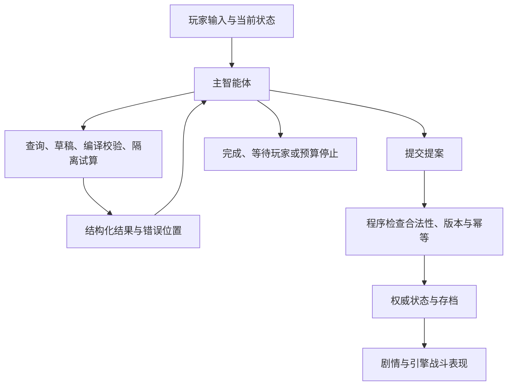

# 独立智能体与卡牌战斗表现层设计

日期：2026-09-22。状态：规划与资料核验，未安装引擎、下载素材、调用模型或实现客户端。主路线见 [Steam 路线](standalone-steam-roadmap.md)。用户要求由主代理直接处理。最新架构指单个主智能体按需调用游戏工具，当前美术沿用现有 emoji＋卡牌战斗。

## 1. 已确定的产品条件

- Steam 低价买断，以 AI 剧情和 AI 爬塔为主；剧情不提供无 AI 玩法，只有一个基础离线爬塔预设。
- 去除色情内容与欲望体系。玩家填写模型 API，游戏脱离 SillyTavern、Tavern Helper 和 MVU。
- 当前美术沿用现有 emoji＋卡牌战斗，优先满足玩法。战斗表现可以由游戏引擎重新实现，不受 HTML 技术限制；不以新立绘、插画或素材库作为前置条件。
- 公开 AI 美术库仅保留为远期设想，当前不开发、不排期、不承诺首发交付。
- 卡牌核心需与宿主分离，方便持续更新；Bilibili Toy 与《杀戮尖塔 2》Mod 暂作架构考虑。两者不改变独立游戏首发范围，详见 [通用核心与二代 Mod 调研](portable-core-and-sts2-mod.md)。

## 2. 引擎比较与推荐

下表的能力依据官方资料，适合程度与工程代价是结合当前 TypeScript 项目的判断，不是同场景性能测试结果。

| 方案 | 对本项目有用的能力 | 迁移与维护代价 | 结论 |
| --- | --- | --- | --- |
| Godot 4 | 2D 场景、UI、动画、粒子、光照/Shader；MIT 许可 | 重建 DOM/CSS 界面，TS 核心需桥接或另行移植；Steam 绑定单独验证 | 精致 2D 的首选验证方案 |
| Unity 6 | 2D 工具与运行时 UI，可扩展更复杂场景和动画 | 重建 C# 表现层及 TS 连接；项目与插件维护需单独投入 | 团队已有 Unity 经验或特定插件需求时考虑 |
| Phaser + Electron | TypeScript、2D WebGL/Canvas，已有核心和部分 Web UI 更易复用 | 独立场景、表现工具与桌面/Steam 集成仍需实现 | 注重复用和较短迁移周期的备选 |
| Unreal Engine | Paper 2D 及 2D/3D 混合表现 | 本项目暂时用不到的 3D 工作流较多，规则与 UI 迁移也没有直接优势 | 当前精致 2D 卡牌方向不优先 |

官方依据：[Godot 功能](https://docs.godotengine.org/en/stable/about/list_of_features.html)、[Godot 许可](https://godotengine.org/license/)、[Godot 语言](https://docs.godotengine.org/en/stable/getting_started/step_by_step/scripting_languages.html)、[Unity 运行时 UI](https://docs.unity.com/en-us/engine/6000.3/manual/uitoolkits/uielements/uie-support-for-runtime-ui)、[Phaser 定位](https://docs.phaser.io/phaser/getting-started/what-is-phaser)、[Unreal Paper 2D](https://dev.epicgames.com/documentation/unreal-engine/paper-2d-overview-in-unreal-engine)。

Electron/Tauri 是桌面宿主，不能单独替代游戏表现设计。引擎选择也不会自动提高模型输出质量，两项工作分别验证。

首选技术切片：Godot 窗口显示长中文卡面、目标选择与状态说明；通过本地消息协议调用现有 TS 核心，播放出牌/受击/结算动画；支持输入法、缩放、快速连续操作和退出恢复。记录帧时间、内存、启动耗时、纹理加载停顿，和当前相同场景比较。先完成这一个切片再定引擎，不同时制作四套客户端。

暂定架构是 Godot 表现进程 + 本地 TS 运行时进程。后者持有规则、状态、AI 编排与存档，随游戏启动/退出；通过受控本机 IPC 交换命令、状态快照与呈现事件。进程桥接需处理握手、版本、退出清理、超时、重复消息和崩溃恢复。该方案保留已有核心，但分发包也要携带相应运行环境；不能把 Godot 本身较轻量等同于组合客户端一定轻量。

尖塔二代采用 Godot／C#，可以带来部分工具经验复用，但它使用自己的内容模型与命令体系；同引擎不代表我们的 TS 内核或场景可以直接作为 Mod 安装。引擎选择仍以独立游戏原型结果为准，不为潜在 Mod 提前维护第二份完整战斗实现。事实依据、复用层次与动态卡牌存档等待验证项见 [二代 Mod 调研](portable-core-and-sts2-mod.md)。

## 3. 单个主智能体与游戏工具

采用类似 Codex 的反馈循环：主智能体理解本次目标，按需查询信息、调用工具、读取结果、修正错误，直到交付可用结果或需要玩家选择。首期不拆成导演、叙事、机制等固定多 agent 团队，也不强制每次请求走同一条长流程。

概念依据为 OpenAI Docs 的 [工具调用流程](https://developers.openai.com/api/docs/guides/function-calling) 与 [Codex 循环说明](https://developers.openai.com/blog/run-long-horizon-tasks-with-codex)。本项目借鉴这一模式，自行定义游戏工具与供应商适配，不要求玩家安装 Codex 或使用特定订阅。

| 拟议工具/组件 | 职责 | 副作用边界 |
| --- | --- | --- |
| 读取游戏状态 | 提供当前场景、角色、牌组、资源和运行版本 | 只读，按需返回相关字段 |
| 查询历史与规则 | 检索已成立剧情、人物记录、规则和内容协议 | 只读，不把摘要当成真实数值状态 |
| 创建/修改内容草稿 | 组织剧情、选项、卡牌、敌人和事件提案 | 仅修改本次任务草稿 |
| 编译校验/试算 | 返回可执行性、错误位置及必要的效果预览 | 隔离快照，不消耗正式随机数、不发奖励 |
| 提交场景提案 | 发布校验成功的内容和允许的状态变化 | 程序检查阶段、状态版本和幂等键后原子提交 |
| 运行控制器 | 持久任务、工具参数校验、预算、取消、恢复 | 程序实现，保有最终状态写入权 |

工具表是接口设计提案，具体名称可在实现时调整。状态变化通过游戏领域工具表达，不授予任意文件、脚本或系统命令执行权。合法构筑的强弱、牌数与创意仍不属于硬门槛。

例如玩家要求构筑召唤流：智能体读取当前角色与召唤规则，创建卡牌草稿，调用编译器；若报告未定义引用，读取相关定义后修正被证明有错的位置，再提交。简单对话可直接完成正文，无需为了满足固定阶段重复查询。内容尚未验证时不发布可执行选项，已发布叙事保持稳定。

普通战斗指令由本地规则执行，智能体不代玩家选牌、领奖或推进未选择的节点。历史与权威状态持久化，摘要只是检索辅助；上下文不足时可以查询，不要求每轮塞入全部世界书。面向玩家展示准备、生成、校验等简短进度和取消入口。

请求带 `runId/requestId/baseRevision`，工具调用有 ID 和结构化结果。应用执行被允许的工具，再把结果传回模型。读/试算工具可按依赖调度，写入串行且可去重；取消、重开或版本过期后不能提交迟到结果。

停止条件明确为：本次结果提交成功、需要玩家选择、玩家取消、服务失败或达到轮数/时限/token 预算。重复工具调用无进展也应停止；保留草稿与诊断供恢复。智能体不能自行声明“通过校验”来跳过程序，有限修复不能扩成无限重试。

先验证模型接口能稳定返回工具调用并接收结果；不支持时明确能力限制。与现有固定生成流程使用相同模型和受限预算比较：需求保留、事实矛盾、可执行率、错误定位、无进展循环、取消恢复、可交互时延与用量。不再把多角色协作作为实施或验收目标。

## 4. 沿用现有美术与商用来源核对

美术以当前版本的 emoji＋卡牌战斗为基线，不安排画风重做或新增大型素材包。现有 emoji 的实际图像/字体来源仍需在商业打包时核对，不能把系统显示出的图形自动认定为某个开源包。

此前建议的 **Twemoji 图像素材**保留为可商用固定包候选，尚未导入或替换现有显示。其图像采用 CC BY 4.0，允许商用和修改，需署名、许可链接及变更说明；代码与图像许可分别记录。来源：[Twemoji](https://github.com/jdecked/twemoji#attribution-requirements)、[图像许可原文](https://raw.githubusercontent.com/jdecked/twemoji/main/LICENSE-GRAPHICS)、[CC BY 4.0 摘要](https://creativecommons.org/licenses/by/4.0/)。

当前不重新展开素材包选型。锁定来源后只处理必要打包、显示一致性和许可留存；需替换的具体资源在实施清单中说明。

接入要求：

1. 核对当前素材来源，锁定可分发版本，保存文件哈希、上游署名和许可证；保留现有图标与用途映射。
2. SVG 用作制作源，构建时输出适合目标尺寸的 PNG/图集；运行时从包内加载，避免系统字体导致跨电脑图案和基线不一致。
3. 用语义 ID 表达用途，用素材 ID 表达具体图像。比如 `element.fire` 可以先映射到 Twemoji 火焰，后映射到 AI 绘制的火焰图标，战斗协议不改变。
4. 如需从生成文本中的 emoji 查图，按完整 Unicode 序列处理组合、肤色和变体；不能把一个可见图标按单码点拆开。未知序列使用分类回退。
5. 游戏内“鸣谢/第三方素材”及随包许可文件提供适用的署名和许可。修改版本记录实际改动，不宣称上游为游戏背书；若采用 CC 素材，不附加限制其许可权利的条款或技术措施。

沿用当前卡牌和 emoji 表达，文字、数值与说明由可执行结构实时排版。首期只补实际影响理解或操作的缺失反馈。

## 5. 游戏引擎中的卡牌战斗实现

沿用现有美术表达与规则，允许重建渲染、动画和输入。Godot 仍是优先验证候选，不要求复用现有 DOM/CSS；也不因使用引擎而复制一套战斗规则。

| 层 | 职责 |
| --- | --- |
| 游戏引擎 | 手牌排列、悬停/拖拽/点击、目标指示、卡牌移动、受击/状态反馈、弹窗和适配 |
| 游戏应用层 | 将玩家输入转换为动作，协调选择/取消、事务、快照与恢复 |
| 现有规则核心 | 费用、目标合法性、效果、触发、牌区、随机、终态和结算 |
| 主智能体 | 生成剧情与内容、查规则、调用校验；不介入每次出牌数值计算 |

动作按请求发送给规则运行时，返回带稳定实例 ID 和顺序的状态/呈现事件；引擎根据结果播放动画。跨进程方案以动作和事件批次通信，不逐帧远程调用。待玩家选择的动作不提前结算；显示与执行在合法交互/事务边界同步。

首个战斗切片验证：手牌选择与取消、单体/群体目标、费用变化、抽弃消耗牌移动、状态与召唤物显示、回合结束、奖励及保存恢复。效果预览与中文说明来自共享结构，不能在 Godot 重写一套伤害公式或把 HTML 展示文本反解析为规则。

动画可加速、跳过或减少；中断动画不能丢失已确认动作，也不能触发重复结算。短反馈服务于玩家理解，不让长演出阻塞后续合法操作。保留当前卡牌标题、类型/词条布局、长说明换行、可操作引用和选择器等契约。

验收分开记录规则结果、交互正确性与帧表现。画面更流畅不能掩盖选错目标、卡牌实例变化或存档语义不一致。

## 6. 美术范围与远期设想

当前只维护本地素材文件/字体、简单用途映射和必要许可记录，沿用现有 emoji 与卡牌美术。优先级为可玩性、智能体生成可靠性、战斗操作、保存恢复。

AI 批量生成美术和公开 AI 友好素材库保留为远期设想。当前不开发公开 API、向量检索、素材服务、风格管理平台或引擎导入器，也不把它们列为首发依赖；未来有明确需求时再立项。简单素材 ID 仅用于方便替换，不预先建设整个平台。

## 7. 低价发行与体验约束

商业方向为低价买断 + 玩家自备 API，初期不提供开发者代付额度或无限云端生成。US$0.99/US$1.99 是可比较的意向档，最终地区价格和折扣按 Steam 后台确认。最低基础价格与最低成交价是不同门槛，不能按汇率猜测人民币下限。[Steam 定价规则](https://partner.steamgames.com/doc/store/pricing?l=english)

Steam 商店明确披露 AI 主功能需要配置外部模型，基础爬塔可离线。自填 API 的接入/付款安排仍须向平台确认；本方案不假设规避平台规则。[Steam AI 内容调查](https://partner.steamgames.com/doc/gettingstarted/contentsurvey?l=english)

低售价不应依赖玩家频繁承担无必要的模型调用。预算优化针对冗余上下文、重复工具调用和无进展修复；用户自定义的合法玩法不因成本优化被程序悄悄降级。当前美术随包本地使用，不增加素材服务或实时出图成本。

当前未实施 Godot 原型、智能体工具循环、性能比较或 Steam 送审；未替换/导入图像。官方资料仅支持候选能力和工具循环概念，游戏实现仍以实际验证证据为准。
