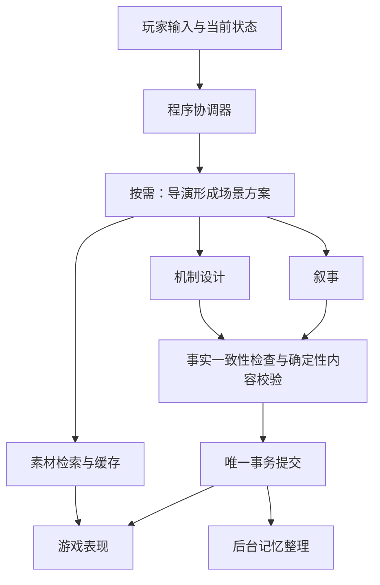

# 精致 2D、独立 AI 编排与公开美术库设计

日期：2026-09-22。状态：规划与资料核验，未安装引擎、下载素材、调用模型或实现客户端。主路线见 [Steam 路线](standalone-steam-roadmap.md)。用户要求由主代理直接处理；本文的多 agent 指游戏内部架构。

## 1. 已确定的产品条件

- Steam 低价买断，以 AI 剧情和 AI 爬塔为主；剧情不提供无 AI 玩法，只有一个基础离线爬塔预设。
- 去除色情内容与欲望体系。玩家填写模型 API，游戏脱离 SillyTavern、Tavern Helper 和 MVU。
- 精致 2D：角色立绘、场景插画、卡牌动画和粒子。初期主要使用统一 emoji，美术逐步扩充。
- 长期建立公开且 AI 易检索、易选用的素材库。素材库独立于游戏引擎，也不要求先完成公共网站才能发布游戏。

## 2. 引擎比较与推荐

下表的能力依据官方资料，适合程度与工程代价是结合当前 TypeScript 项目的判断，不是同场景性能测试结果。

| 方案 | 对本项目有用的能力 | 迁移与维护代价 | 结论 |
| --- | --- | --- | --- |
| Godot 4 | 2D 场景、UI、动画、粒子、光照/Shader；MIT 许可 | 重建 DOM/CSS 界面，TS 核心需桥接或另行移植；Steam 绑定单独验证 | 精致 2D 的首选验证方案 |
| Unity 6 | 2D 工具与运行时 UI，可扩展更复杂场景和动画 | 重建 C# 表现层及 TS 连接；项目与插件维护需单独投入 | 团队已有 Unity 经验或特定插件需求时考虑 |
| Phaser + Electron | TypeScript、2D WebGL/Canvas，已有核心和部分 Web UI 更易复用 | 独立场景、表现工具与桌面/Steam 集成仍需实现 | 注重复用和较短迁移周期的备选 |
| Unreal Engine | Paper 2D 及 2D/3D 混合表现 | 本项目暂时用不到的 3D 工作流较多，规则与 UI 迁移也没有直接优势 | 当前精致 2D 卡牌方向不优先 |

官方依据：[Godot 功能](https://docs.godotengine.org/en/stable/about/list_of_features.html)、[Godot 许可](https://godotengine.org/license/)、[Godot 语言](https://docs.godotengine.org/en/stable/getting_started/step_by_step/scripting_languages.html)、[Unity 运行时 UI](https://docs.unity.com/en-us/engine/6000.3/manual/uitoolkits/uielements/uie-support-for-runtime-ui)、[Phaser 定位](https://docs.phaser.io/phaser/getting-started/what-is-phaser)、[Unreal Paper 2D](https://dev.epicgames.com/documentation/unreal-engine/paper-2d-overview-in-unreal-engine)。

Electron/Tauri 是桌面宿主，不能单独替代游戏表现设计。引擎选择也不会自动提高模型输出质量，两项工作分别验证。

首选技术切片：Godot 窗口显示长中文卡面、目标选择与状态说明；通过本地消息协议调用现有 TS 核心，播放出牌/受击/结算动画；支持输入法、缩放、快速连续操作和退出恢复。记录帧时间、内存、启动耗时、纹理加载停顿，和当前相同场景比较。先完成这一个切片再定引擎，不同时制作四套客户端。

暂定架构是 Godot 表现进程 + 本地 TS 运行时进程。后者持有规则、状态、AI 编排与存档，随游戏启动/退出；通过受控本机 IPC 交换命令、状态快照与呈现事件。进程桥接需处理握手、版本、退出清理、超时、重复消息和崩溃恢复。该方案保留已有核心，但分发包也要携带相应运行环境；不能把 Godot 本身较轻量等同于组合客户端一定轻量。

## 3. 多 agent 如何分工

采用一个程序协调器和按需调用的专职角色。各角色可使用同一模型和同一 API 配置，不要求玩家购买多个服务。角色是逻辑边界，不为每个角色部署服务器。

| 角色/组件 | 输入与产物 | 何时调用 |
| --- | --- | --- |
| 程序协调器 | 当前状态、任务依赖、预算、取消、提交 | 每个动作；不必是模型 |
| 导演 agent | 玩家意图、场景、已知事实 → 场景方案、实体与约束 | 新场景、重大转折、复杂遭遇 |
| 叙事 agent | 已成立事实与场景方案 → 正文、对话和选项 | 剧情推进；普通对话可直接调用 |
| 机制 agent | 场景需求与规则子集 → 卡牌、敌人、事件和候选状态变化 | 出现新机制或需结构化结算时 |
| 美术检索组件/agent | 实体需求 → 检索条件、候选素材 ID | 新角色/场景/卡牌；先规则筛选，必要时模型重排 |
| 记忆整理 agent | 已提交剧情与事实 → 摘要和索引建议 | 后台批量处理，不在每次回复关键路径上 |
| 按需审查 agent | 候选结果与事实 → 矛盾、需求遗漏报告 | 复杂开局、重大状态变化或诊断触发 |

所有 agent 都只能提出候选结果。程序是唯一状态写入者，确定性编译器负责结构和执行语义校验。审查 agent 不以质量判断阻止合法构筑，不替代程序证明。

并行仅发生在依赖已满足时。叙事与机制若共享已确定的场景方案，可以并行；若机制依赖正文中的新事实，则必须等待该事实确定。正文与结构发生冲突时保留草稿并有限修复，在两者就绪前不发布可执行选项。流式文字可显示生成中的草稿，但不能使未通过验证的状态生效；已经发布的叙事保持稳定。

普通战斗指令全部在本地执行。美术检索失败回退到本地 emoji，不阻塞出牌；摘要失败保留原历史，不损失真实状态。后续新场景不因角色切换随机换脸：人物 ID 及对应素材族在存档中固定。

请求带 `runId/requestId/baseRevision`，提交检查版本与取消状态。所有角色共享本次请求的重试、token 与并发预算，禁止每层各自叠加多轮修复。工具只暴露状态读取、记忆检索、内容试编译与素材查询；agent 不可任意写档或执行脚本。

多 agent 是可验证的设计假设。研究显示其收益与任务能否合理拆解有关，不能把其他领域的提升比例当作本游戏效果。[Google Research](https://research.google/blog/towards-a-science-of-scaling-agent-systems-when-and-why-agent-systems-work/)

评估使用同一组开局、纯对话、复杂卡牌、长剧情接续和取消样本，对比单角色分阶段基线与专职角色方案。控制模型与总预算，记录：需求保留、事实矛盾、首次可执行率、修复后成功率、实际可交互时延、输入输出用量及玩家偏好。不把首 token 出现时间当作内容已就绪。角色数量只随证据调整。

## 4. 初期 emoji 的选择与接入

选择 **Twemoji 图像素材**作为初期统一包。其图像采用 CC BY 4.0，允许商用和修改，需署名、许可链接及变更说明；代码与图像许可分别记录。来源：[Twemoji](https://github.com/jdecked/twemoji#attribution-requirements)、[图像许可原文](https://raw.githubusercontent.com/jdecked/twemoji/main/LICENSE-GRAPHICS)、[CC BY 4.0 摘要](https://creativecommons.org/licenses/by/4.0/)。

其他可选项：Noto Emoji 的字体为 OFL 1.1，多数图像为 Apache 2.0，具体文件需按所在包确认；OpenMoji 图像为 CC BY-SA 4.0，改编素材有相同许可要求。本项目首期不混用多套。[Noto 说明](https://github.com/googlefonts/noto-emoji#license)、[OpenMoji 说明](https://github.com/hfg-gmuend/openmoji#license)

接入要求：

1. 选定稳定版本/提交，保存来源、文件哈希、上游署名和许可证。当前只完成选型，尚未锁定或引入实际素材文件。
2. SVG 用作制作源，构建时输出适合目标尺寸的 PNG/图集；运行时从包内加载，避免系统字体导致跨电脑图案和基线不一致。
3. 用语义 ID 表达用途，用素材 ID 表达具体图像。比如 `element.fire` 可以先映射到 Twemoji 火焰，后映射到 AI 绘制的火焰图标，战斗协议不改变。
4. 如需从生成文本中的 emoji 查图，按完整 Unicode 序列处理组合、肤色和变体；不能把一个可见图标按单码点拆开。未知序列使用分类回退。
5. 游戏内“鸣谢/第三方素材”及随包许可文件提供署名；公开目录在每条素材记录保留同样信息。修改版本记录实际改动，不宣称上游为游戏背书，不对 CC 素材附加限制其许可权利的条款或技术措施。

普通状态图标、元素、物品、简化敌人可先用 emoji；角色外形和场景由统一卡框、剪影、背景配色与动效补足。文字和数值由游戏实时排版，避免写进生成图片后难以更新或本地化。

## 5. 美术库从第一版就预留的结构

公开库要让程序与 AI 能按条件找到正确素材，并能稳定复用。基础文件使用引擎无关的图片和 JSON，Godot/Unity/Web 的导入格式是派生产物。

| 元数据 | 用途 |
| --- | --- |
| 素材 ID、版本、哈希、可替代素材 ID | 精确下载、缓存、存档恢复与升级 |
| 类别、主题、元素、情绪、颜色、中英文描述 | 关键词、标签和后续语义检索 |
| 风格包 ID、角色/素材族 ID、表情/姿态/视角 | 保持整局风格及人物身份一致 |
| 分辨率、宽高比、透明背景、裁切与锚点、适用位置 | 判断能否直接用于图标、卡面、立绘或背景 |
| 来源、作者、许可、署名、变更记录 | 区分第三方 emoji、自制 AI 素材和衍生版本 |
| 生成器/模型版本、生成记录、参考素材来源 | 复现、复核与批量变体管理；敏感生成参数不公开 |

公开 API 先提供搜索、详情、变体、清单和下载；输出 JSON，并描述错误、分页、配额和版本。MCP 可以作为后续薄适配层，不能成为唯一访问方式。先实现标签和关键词筛选，规模增长后再增加向量检索和模型重排。

检索顺序：先筛类别、尺寸、风格、来源许可等硬条件，再排语义相关性；返回少量候选、缩略图和匹配理由。程序核实素材 ID 和权限，AI 不凭空编下载地址。人物一旦选定素材族，在后续表情/服装变体中保持身份；回退不得静默变成另一个人物。

“AI 友好”首先指可机器检索与使用。商用、修改、再分发、作为生成参考、模型训练等用途的授权信息分别记录，未知就标记未知；不能因为是 AI 生成或公开下载就自动认定全部用途获准。公开库不统一覆盖第三方素材的原始许可。

## 6. 制作、发布与运行时选择

分三步演进：

1. **游戏首发前**：本地 Twemoji 包、语义目录、统一 UI 和动效。游戏安装包自带必要素材；AI 只按需检索已有图像。
2. **游戏主链稳定后**：制定风格、尺寸和构图规范，生成一小批代表性图标/角色/背景；人工挑选、修整透明边缘、检查小尺寸识别和身份一致性，通过后才批量扩充。
3. **公共素材库阶段**：发布版本化目录、许可记录、预览与下载 API，增加分发缓存和引擎导入器；以实际缺口驱动批量生成。

游戏按需选用已有素材，首发不把实时图片生成放入每次剧情的等待链。素材库不在线时仍可使用本地缓存和 emoji。Godot 支持运行时加载图像，但解码、纹理上传与内存需要实测预算，不能仅因支持加载就假设没有卡顿。[Godot 运行时文件加载](https://docs.godotengine.org/en/stable/tutorials/io/runtime_file_loading_and_saving.html)

存档记录实际选定的素材 ID/版本/哈希及语义需求；镜像或 URL 可变化，身份不可变化。以原子方式安装完成的缓存文件，下载失败不标记成功。公开分发只接收批准的图片/元数据格式，不把任意引擎场景、插件或脚本当成美术加载。

AI 大量出图前先确定构图、留白、透明度、线条、配色、光源、视角和家族一致性。单张漂亮插画不自动具备立绘表情组、分层动画或特效序列；这些分别制定制作规格和质量检查。

## 7. 低价发行与体验约束

商业方向为低价买断 + 玩家自备 API，初期不提供开发者代付额度或无限云端生成。US$0.99/US$1.99 是可比较的意向档，最终地区价格和折扣按 Steam 后台确认。最低基础价格与最低成交价是不同门槛，不能按汇率猜测人民币下限。[Steam 定价规则](https://partner.steamgames.com/doc/store/pricing?l=english)

Steam 商店明确披露 AI 主功能需要配置外部模型，基础爬塔可离线。自填 API 的接入/付款安排仍须向平台确认；本方案不假设规避平台规则。[Steam AI 内容调查](https://partner.steamgames.com/doc/gettingstarted/contentsurvey?l=english)

低售价不应依赖玩家频繁承担无必要的模型调用。预算优化先针对冗余上下文、每步全角色调用、重复修复和无谓图片生成；用户自定义的合法玩法不因成本优化被程序悄悄降级。素材生成、存储、带宽和维护分别记录成本，公共库可独立迭代。

当前未实施 Godot 原型、性能比较、模型 A/B 或 Steam 送审；未生成/导入图像。选型结论与许可条款已核对官方资料，实际发布仍以选定版本、随包文件和验证证据为准。
