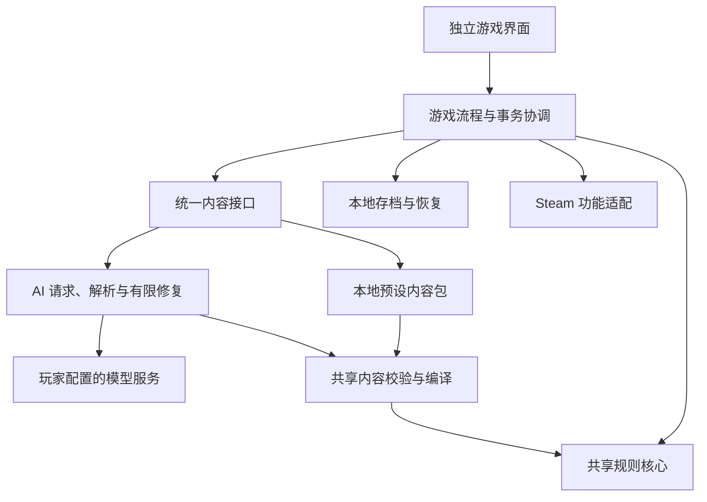

# 独立游戏与 Steam 实现路线（提案）

日期：2026-09-22。需求：上架 Steam；内置几个断网可玩的预设；玩家填写模型 API 后可以自由创作和游玩；彻底移除色情内容、欲望条及欲望体系；保留剧情模式。本次交付是路线规划，未开始机制清理或独立客户端实现，也未提交 Steam 审核。

## 1. 产品定义与首发范围

建议定位为：**拥有完整离线内容的卡牌冒险游戏，提供可选的 AI 自由冒险模式。** 玩家购买后无需 API 即可体验完整游戏；AI 模式拓展世界观、角色、卡组、事件和剧情。

建议首发 Windows、中文、单人、键鼠操作，**剧情模式与爬塔模式均为首发必需功能**。工程上先打通确定性的短流程，同时保留剧情入口与独立叙事状态；完整剧情链必须在首发送审前完成。首发内容建议为三个差异明显的离线预设，其中至少一个重点展示分支剧情，其他可突出基础连击、状态经营或召唤协同。具体题材、数量和时长仍需内容设计确认，不能用三个开局配置代替三套完整体验。

| 玩法 | 断网预设 | 填写 API 后 |
| --- | --- | --- |
| 剧情模式 | 预写剧情、条件分支、角色互动、战斗及结局 | 自由输入、角色扮演、动态剧情、世界状态与长期记忆 |
| 爬塔模式 | 本地内容池、随机路线、构筑、事件及完整结算 | 自定义世界和构筑方向，动态生成开局及后续节点 |

离线剧情以本地可计算的分支和选项运作；无限制自然语言续写需要模型。两者都保留剧情体验，但不把预写文本宣传为任意输入均能得到新剧情。

主菜单提供“预设冒险”“AI 自由冒险”“继续游戏”“设置”。API 配置只在 AI 模式需要；预设模式第一次运行也不能依赖模型、在线字体、远程图片或开发服务器。

“自由游玩”指在游戏支持的规则和内容协议中自由创作。模型接口兼容性和实际生成能力分别验证；不承诺任意模型都能正确生成，也不让模型输出任意可执行脚本。保留现有边界：合法构筑的牌数、强度、攻防比例和创意由玩家与 Prompt 决定；程序只拦截无法执行的结构，修复只针对已证明错误的槽位。

## 2. 已有基础与迁移边界

规划基线为当前 1.0.3 工作树；仓库另有既有未提交内容，实施时须冻结选定源码快照，不能默认仅 checkout HEAD 就包含全部现状。当前版本及最近本地安装记录见 [项目交接](../PROJECT_HANDOFF.md)，核心职责见 [后端边界](../backend-boundaries.md)。

| 现有部分 | 独立版处理 |
| --- | --- |
| `src/game-core` | 复用卡牌编译、规则、状态、战斗、确定性随机、奖励与路线等纯逻辑；按实际入口核对闭包 |
| `src/portable`、`src/adapters/referenceBattleRuntimeHost.ts` | 作为独立宿主接入起点；当前公开面主要为卡牌/战斗，需补充整局、爬塔及展示的独立门面 |
| 当前 Prompt、Schema、registry 编译、有限修复 | 提取与宿主无关的内容生产链；保留字段、修复白名单及执行语义一致性 |
| `src/common`、`src/fish`、`src/start` | 复用可独立的卡面、说明及交互部件；重新管理页面和视图生命周期 |
| `src/runtime`、酒馆扩展 | 拆出请求编排、状态协调；以本地运行实例、版本号和文件存档替代聊天/楼层/MVU 绑定 |
| 世界书和酒馆 preset | 整理为可版本化的世界设定、叙事风格、上下文和规则资源；逐项确认实际注入行为 |

独立版需要自己的剧情历史、上下文预算、摘要与持久记忆；不能认为把“模型请求 URL”替换掉就接替了酒馆。卡牌/战斗核心的可移植性也不能代表爬塔 controller 和剧情链都已完成解耦。

只读源码核对还确认：地图、营火和终局已有本地规则；开局馈赠及多数可达节点仍走实时内容生成。迁移重点是 controller 的聊天/状态提交耦合、节点激活对 MVU 字段的投影，以及随机源是否全部显式注入。已有接口与测试只是迁移基础，尚未构成独立版实测证据。

随机源的具体情况：`summonUnit.ts` 部分公开辅助函数允许省略随机参数并使用 `Math.random`，现有正式战斗调用会注入确定性随机。独立宿主需延续显式注入，不能将此误报为现有战斗必然不确定。

## 3. 移除色情与欲望体系，保留剧情

这一要求作为独立版基线清理，放在内容包与存档格式冻结之前：

- 内容层：清理角色设定、世界书、preset、示例、图片与其他素材中的色情内容，重新定义健康的角色关系、冒险冲突和剧情主题。
- 生成层：删除要求或暗示生成相关内容的 Prompt、欲望字段、特殊事件和专用修复建议；剧情模型、机制模型及失败重试共用新边界。
- 规则层：删除专用数值、上限、增长/减少、阈值/溢出、专属触发与结算、卡牌效果及相关引用，排查其对伤害、资源和终态的依赖。
- 数据与显示层：同步 Schema、编译与投影、修复白名单、存档、状态栏、欲望条、详情、图标、教程及双说明链；不是隐藏控件后继续保留后台字段。
- 回归层：删除只服务已移除体系的用例，重建无欲望字段的有效夹具；保留通用战斗、资源、状态、剧情恢复及选择/取消回归。旧数据明确拒绝，不猜测把欲望转换成其他属性。

普通生命、能量、金币、通用资源、状态、召唤物、关系与任务系统按实际职责保留。剧情模式保留自由输入、角色设定、世界连续性、事件、战斗前后叙事和保存恢复。独立产品使用新数据目录，既有玩家酒馆存档不改写。

验收同时检查代码引用、生成契约、最终打包资源与真实模型样本；关键词扫描只是辅助，不能代替语义审查。形成明确变更记录，说明删除范围及新开局要求。

已核对的首批清理入口：

| 范围 | 关键文件 |
| --- | --- |
| Prompt 与作者协议 | `src/sillytavern-extension/initialDraftPrompt.ts`、`src/game-core/authoredEffectProtocol.ts` |
| Schema、编译与校验 | `src/game-core/aiContentJsonSchema.ts`、`compactEffectDsl.ts`、`contentContract.ts`（后两者同属 `src/game-core`） |
| 战斗数值与效果 | `src/game-core/battleState.ts`、`src/game-core/battleEffectRuntime.ts` |
| 当前宿主投影 | `src/runtime/mvuBattleContentNormalizer.ts`，以及相应事件、奖励和永久成长投影 |
| 界面与说明 | `src/common/index.html`、`src/game-core/contentDescription.ts`、`src/game-core/effectDisplay.ts`，并追踪战斗和开始视图 |

以 `lust`、`max_lust` 及其操作、阈值触发和结算作为依赖追踪起点；这份表不是完整删除清单，实际修改前仍需检查调用者、共享字段表、世界书和现有回归。

## 4. 技术方案

建议先验证 **TypeScript 规则核心 + 独立 Web 界面 + Electron 桌面宿主**。Electron 使用 HTML/CSS/JavaScript 并打包 Chromium 与 Node.js，适合复用现有技术栈。这是基于本项目迁移成本的判断，需由原型验证启动速度、内存和战斗表现。[Electron 官方说明](https://www.electronjs.org/docs/latest/)

Tauri 可作为备选：使用系统 WebView，Windows 开发还涉及 Rust、C++ 构建工具和 WebView2。选择它需要另做运行环境与 Steam 接入验证。只有独立原型证明现有 Web 表现难以满足目标，或明确转向大量原生场景表现时，再评估更换游戏引擎。[Tauri 前置要求](https://v2.tauri.app/start/prerequisites/)

两个模式共用执行、存档与显示链。内容来源不同，战斗规则、实例编号、奖励事务和中文说明保持一致。AI 只提出候选内容；通过校验并核对运行实例与状态版本后，才能由游戏事务提交。

实施可新增 `src/standalone`、`src/desktop`、`content/presets` 和离线内容构建脚本；这些均是拟议路径。先在同一仓库独立入口/构建目标演进，保留共享核心单一来源。禁止在新 UI 中复制另一份战斗规则。

Electron 主进程负责文件与凭据访问、模型网络请求；界面通过有限命令调用。渲染进程启用隔离与沙箱，模型文本不能调用 Node 或系统能力。[Electron 安全边界](https://www.electronjs.org/docs/latest/tutorial/security)

## 5. 离线预设需要怎样制作

每个预设是可完整结算的内容包，至少包含：

- 版本清单、适用规则版本、内容标识、资源列表和来源记录。
- 角色、初始牌组、卡牌池、状态、资源、召唤物、姿态、遗物的完整定义与引用。
- 地图规则、各阶段遭遇池、敌人/首领、商店商品、营火操作、奖励池和升级规则。
- 事件的条件、选项、结果、剧情文本，以及通关和失败结局。
- 必需的图片、字体和音频本地资源。

采用“有限内容池 + 条件分支 + 确定性随机”支持重复游玩；不需要预先写出每一次洗牌或穷举全部战斗。卡牌升级、永久成长、删牌等仍由规则计算。需要预先覆盖的是所有可能调用外部生成的内容槽位。

增加内容构建检查：引用闭包、节点类型覆盖、事件分支结果、奖励/商品池可用性、终局可达、素材存在性。制作工具可用 AI 生成草稿，正式内置内容经人工编辑与实玩后冻结。一个任意 AI 存档不能直接标为“完整离线预设”。

离线节点通过同一内容契约校验后，才标记为可进入并交给激活/结算流程；不能用强制 `ready` 绕过引用和状态核验。离线包的修复在制作与构建阶段完成，游玩时不触发修复性联网。

离线验收以禁网为条件：从首次启动、新建游戏、所有节点类型到胜败结算、退出重开，全程可进行；检测隐藏网络依赖。既有预设方向配置需补齐上述内容才可交付。

## 6. AI 接入与存档

先支持一个明确的接口协议及少量实测服务，再扩展供应商适配。设置提供服务地址、模型、凭据、连通性测试和能力提示。叙事模型与机制模型可以共用配置，也可分别选择；结构化输出、流式输出和取消能力按适配器能力声明处理。

模型请求保留“叙事 → 结构化内容 → 编译校验 → 有限修复 → 事务提交”的职责分离。先迁爬塔开局/节点，再迁自由剧情上下文、状态更新和战后续写。不要把现有酒馆破限 preset 原样当作 Steam 产品默认配置。

为调用建立全局重试预算、超时、取消和可恢复失败界面。使用运行 ID、请求 ID、基础状态版本拒绝迟到结果；模型失败不推进节点、不扣重复费用、不重复领奖。记录延迟、用量及失败类型，价格未知时只显示用量，避免虚构金额。首轮真实模型测试需事先限定样本及费用预算。

本地存档至少保存规则/存档版本、运行 ID、内容包版本及哈希、已提交生成内容、当前牌组实例、战斗快照、随机游标、路线和奖励事务、剧情历史。单一写入者按事务提交，使用临时文件替换与上一份有效备份；失败或中断后恢复到完整事务边界。保存待处理选择并验证恢复，或清晰限定只能在可恢复边界退出。

API key 存在系统凭据存储或操作系统保护的本地秘密文件，独立于存档、日志和 Steam Cloud。普通存档只引用配置 ID。AI 局断网后可继续已有内容，遇到缺失内容时暂停并允许保存/稍后重试；不静默替换成另一套预设。

独立版采用自己的存档命名空间，不自动导入或改写玩家酒馆存档。支持范围按当前项目约定明示，旧协议数据保留原文件并提示需要新开局；Steam 正式版后续存档支持策略另行明确。

## 7. 分阶段交付与验收

估算基于 1—2 名主要开发者、有限美术音频支持、保留现有二维卡牌界面，并完成色情/欲望清理及两种玩法；是工作量判断，尚非实测排期。含联调与返工余量，先按约 14—22 周形成可送审候选版规划，内容制作、玩法迭代与平台沟通会影响工期。

| 阶段 | 参考投入 | 可交付结果 | 放行条件 |
| --- | --- | --- | --- |
| P0 基线清理与技术验证 | 1—2 周，平台沟通并行 | 无色情/欲望的规则、数据与生成契约，依赖清单、桌面/Steam 接入实验 | 清理全链路引用且通用机制回归有效；独立核心消费可行；Steam BYOK 形成待确认材料 |
| P1 独立可玩原型 | 1—2 周 | 桌面程序、主菜单、剧情/爬塔入口、本地存档、一条短冒险 | 关闭酒馆与开发服务器，完成剧情选择、战斗、奖励、退出重开；规则语义与清理后核心一致 |
| P2 完整离线预设 | 2—3 周 | 一套完整离线冒险、内容打包/检查工具 | 禁网贯通各类节点、剧情分支及结局；缺失引用为零；分别验证剧情与爬塔入口 |
| P3 AI 爬塔 | 2—4 周 | API 设置、叙事与机制请求、节点生成及恢复 | 真实模型开局/连续节点/跨幕可玩；取消、断网、超时、迟到响应及重试不损坏存档 |
| P4 AI 剧情与内容扩充 | 2—4 周 | 首发必需的独立剧情循环、其余预设、教程和关键音画 | 自由输入、上下文接续、状态更新、战后剧情及重开恢复贯通；三个预设均有独立通关记录 |
| P5 Steam 候选与打磨 | 3—5 周，部分可并行 | 可分发构建、商店素材、云存档/成就候选、测试反馈修复 | 干净 Windows 机器与 Steam 启动通过，离线模式可靠，构建和商店承诺一致，提交正式审核 |

首先完成 P0/P1，预计用约 2—4 周获得一个约 20—30 分钟的独立短冒险，以此评估 UI、宿主解耦和内容工作量，再修正后续排期。P1 的短流程只是工程验收切片，不能代替完整首发游戏。

P0 中提前做 Steam 启动及所选 SDK 绑定的原型验证。成就、云存档和覆盖层分别验收，不把“窗口能打开”算成全部 Steam 功能已支持。JavaScript 等语言的 SDK 集成需要核对第三方绑定或实现本地桥接。[Steamworks API 接入说明](https://partner.steamgames.com/doc/sdk/api)

商店页与内容制作可在离线切片稳定后并行。云存档可评估 Auto-Cloud 的目录同步；云同步限定游戏存档，不包含凭据和诊断原文。[Steam Cloud 文档](https://partner.steamgames.com/doc/features/cloud)

## 8. Steam 立项时必须确认的事项

当前官方规则要求申报预生成/实时生成 AI 内容，实时生成需要说明防护措施。自填 API 方案的具体接入和费用安排未获得 Valve 确认，应向 Steamworks 提交说明，不能视作规则豁免。[内容调查与 AI 规则](https://partner.steamgames.com/doc/gettingstarted/contentsurvey?l=english)

需准备的说明材料：游戏无 API 时的完整功能、API 是否可选、谁向服务商付费、是否存在游戏内售卖/导购、生成内容范围和控制方式。产品方向已确定去除色情内容及欲望体系，生成输入与输出也应匹配这一方向。平台确认可以与离线核心开发并行；本任务没有代用户联系平台。

商店介绍明确预设离线可玩、AI 功能需要玩家配置及可能产生外部费用，最终措辞按平台确认结果调整。整理素材、字体、音频、第三方代码和预设文本的来源及商业使用依据；官方预设内容与玩家自生成内容分开标识。平台审核是独立里程碑，不能由本地测试替代。

提前安排 Steam 入驻：官方入驻页列有适用的缴费后 30 天等待期与 Coming Soon 至少两周要求，具体以账户条件和提交时规则为准。[入驻流程](https://partner.steamgames.com/doc/gettingstarted/onboarding?l=english) 商店页和构建需分别预留审核与返修时间。[审核流程](https://partner.steamgames.com/doc/store/review_process?l=english)

## 9. 实施验证与当前证据边界

实施时沿用 `test:portable-boundary`、`test:portable-package`、`test:reference-battle-session-host` 等现有核心证据；`test:portable-package` 必须针对同一源码快照的构建产物运行。再按改动选择内容契约、选择/取消、回滚、存档和显示回归，避免每步盲跑全部发布流水线。

增加具有用户结果的独立宿主验收：两种内容源得到相同确定性结算；断电式中断不出现半份存档；领奖重放不重复发放；随机状态恢复一致；AI 取消后迟到响应不写入；离线预设所有节点类型可完成。新机制仍需同步 Prompt/Schema/编译/校验修复/执行交互/保存恢复及 `contentDescription.ts`、`effectDisplay.ts` 双说明链。

建议为 AI 候选版收集至少 20 次新开局、50 次各类节点请求的有限样本，记录首次成功、修复后成功、延迟及用量，再用连续完整冒险验证状态接续。样本数量是拟议验收计划，当前并未执行，也不能据此保证任意模型表现。

本次仅核对项目文档、源码边界和官方平台资料，保存路线提案；未构建桌面客户端、未测试 Steam SDK、未调用真实模型、未进行独立游戏实玩。文档提案没有运行时变化，因此不生成或安装新的酒馆角色卡。后续若修改共享运行时，仍按项目要求完成隔离构建、备份、哈希核验及本地最新测试卡同步。
