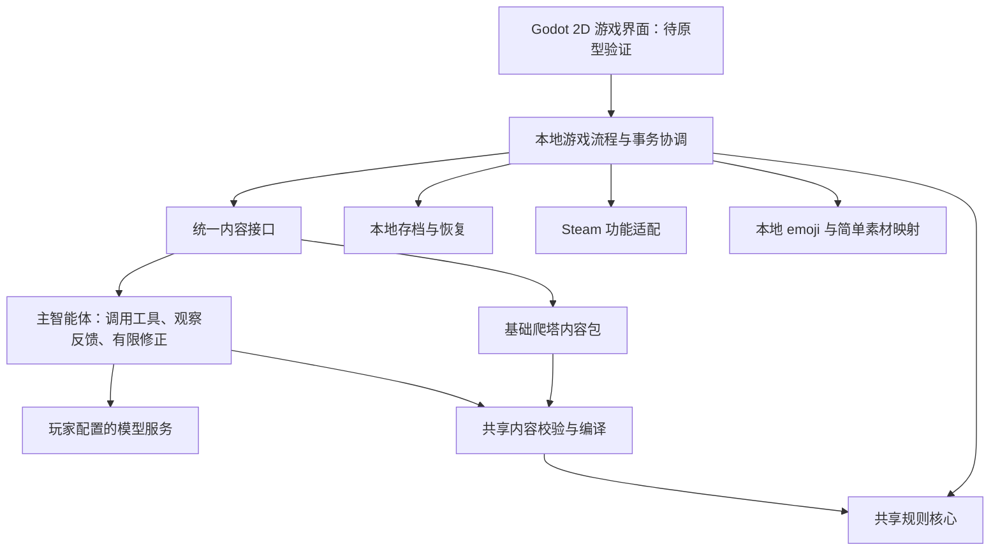

# 独立游戏与 Steam 实现路线（提案）

日期：2026-09-22。最新需求：低价买断上架 Steam；以 AI 为主要特色；剧情模式必须接入 AI；爬塔提供一个简单但可完整游玩的离线预设，并支持 AI 自定义；脱离酒馆，采用类似 Codex 的工具调用智能体模式；彻底移除色情内容和欲望体系。美术沿用当前 emoji＋卡牌战斗，战斗可用游戏引擎重建，不受 HTML 限制；公开 AI 美术库仅为远期设想。本次仅规划，未开始机制清理或独立客户端实现。

本次补充约定：后续规划和执行由主代理直接处理，不再使用子代理。下文技术选择、内容数量与工作量均为规划建议；用户明确的产品需求为不可省略范围。

## 1. 产品定义与首发范围

定位为：**以 AI 自由剧情与动态卡牌冒险为核心卖点的低价独立游戏。** 玩家自备模型 API；无需 API 的内容仅为一个基础爬塔预设。商店不能宣传所有模式离线可玩。

建议首发 Windows、中文、单人、键鼠。AI 剧情和 AI 爬塔均为首发必需功能；基础离线爬塔用于教学、体验和规则回归。取消此前离线剧情、三套完整官方预设及其制作排期。画面保持 2D 方向，当前验收重点为规则可读、对象可辨、选择可操作、反馈清楚；大量立绘、插画和复杂特效不进入当前交付要求。

| 玩法 | 断网预设 | 填写 API 后 |
| --- | --- | --- |
| 剧情模式 | 不提供无 AI 玩法 | 自由输入、角色扮演、动态剧情、世界状态与长期记忆 |
| 爬塔模式 | 一个简单预设，包含必要节点与完整结算 | 自定义世界和构筑方向，动态生成开局及后续节点 |

AI 局断网后可以查看已保存内容，完成已具备全部数据的战斗；需要生成新内容时暂停并允许保存重试。这不构成独立的离线剧情模式。

主菜单提供“AI 剧情”“爬塔”“继续游戏”“设置”；爬塔入口区分基础预设与 AI 自定义。首次使用 AI 时引导配置和测试 API，清楚说明外部调用费用。基础爬塔首次运行不能依赖模型、在线字体、远程图片或开发服务器。

“自由游玩”指在游戏支持的规则和内容协议中自由创作。模型接口兼容性和实际生成能力分别验证；不承诺任意模型都能正确生成，也不让模型输出任意可执行脚本。保留现有边界：合法构筑的牌数、强度、攻防比例和创意由玩家与 Prompt 决定；程序只拦截无法执行的结构，修复只针对已证明错误的槽位。

首发暂不纳入联网对战、开发者代付模型服务、账号体系、创意工坊、手机端和完整模组编辑器。公开素材库保留为设想，当前不安排目录服务、公开 API、AI 选图或批量出图；只保留简单本地素材引用与许可记录。Steam Deck、手柄与其他操作系统在分别验收前不作兼容承诺。

## 2. 已有基础与迁移边界

规划基线为当前 1.0.3 工作树；仓库另有既有未提交内容，实施时须冻结选定源码快照，不能默认仅 checkout HEAD 就包含全部现状。当前版本及最近本地安装记录见 [项目交接](../PROJECT_HANDOFF.md)，核心职责见 [后端边界](../backend-boundaries.md)。

| 现有部分 | 独立版处理 |
| --- | --- |
| `src/game-core` | 复用卡牌编译、规则、状态、战斗、确定性随机、奖励与路线等纯逻辑；按实际入口核对闭包 |
| `src/portable`、`src/adapters/referenceBattleRuntimeHost.ts` | 作为独立宿主接入起点；当前公开面主要为卡牌/战斗，需补充整局、爬塔及展示的独立门面 |
| 当前 Prompt、Schema、registry 编译、有限修复 | 提取与宿主无关的内容生产链；保留字段、修复白名单及执行语义一致性 |
| `src/common`、`src/fish`、`src/start` | 保留交互规则和信息布局经验；若使用 Godot，DOM/CSS 界面需要重建，不能声称直接复用 |
| `src/runtime`、酒馆扩展 | 拆出请求编排、状态协调；以本地运行实例、版本号和文件存档替代聊天/楼层/MVU 绑定 |
| 世界书和酒馆 preset | 整理为可版本化的世界设定、叙事风格、上下文和规则资源；逐项确认实际注入行为 |

独立版需要自己的剧情历史、上下文预算、摘要与持久记忆；不能认为把“模型请求 URL”替换掉就接替了酒馆。卡牌/战斗核心的可移植性也不能代表爬塔 controller 和剧情链都已完成解耦。

只读源码核对还确认：地图、营火和终局已有本地规则；开局馈赠及多数可达节点仍走实时内容生成。迁移重点是 controller 的聊天/状态提交耦合、节点激活对 MVU 字段的投影，以及随机源是否全部显式注入。已有接口与测试只是迁移基础，尚未构成独立版实测证据。

随机源的具体情况：`summonUnit.ts` 部分公开辅助函数允许省略随机参数并使用 `Math.random`，现有正式战斗调用会注入确定性随机。独立宿主需延续显式注入，不能将此误报为现有战斗必然不确定。

## 3. 移除色情与欲望体系，保留剧情

这一要求作为独立版基线清理，放在内容包与存档格式冻结之前：

- 内容层：清理角色设定、世界书、preset、示例、图片与其他素材中的色情内容，重新定义健康的角色关系、冒险冲突和剧情主题。
- 生成层：删除要求或暗示生成相关内容的 Prompt、欲望字段、特殊事件和专用修复建议；剧情模型、机制模型及失败重试共用新边界。
- 规则层：删除专用数值、上限、增长/减少、阈值/溢出、专属触发与结算、卡牌效果及相关引用，排查其对伤害、资源和终态的依赖。
- 数据与显示层：同步 Schema、编译与投影、修复白名单、存档、状态栏、欲望条、详情、图标、教程及双说明链；不是隐藏控件后继续保留后台字段。
- 回归层：删除只服务已移除体系的用例，重建无欲望字段的有效夹具；保留通用战斗、资源、状态、剧情恢复及选择/取消回归。旧数据明确拒绝，不猜测把欲望转换成其他属性。

普通生命、能量、金币、通用资源、状态、召唤物、关系与任务系统按实际职责保留。剧情模式保留自由输入、角色设定、世界连续性、事件、战斗前后叙事和保存恢复。独立产品使用新数据目录，既有玩家酒馆存档不改写。

验收同时检查代码引用、生成契约、最终打包资源与真实模型样本；关键词扫描只是辅助，不能代替语义审查。形成明确变更记录，说明删除范围及新开局要求。

已核对的首批清理入口：

| 范围 | 关键文件 |
| --- | --- |
| Prompt 与作者协议 | `src/sillytavern-extension/initialDraftPrompt.ts`、`src/game-core/authoredEffectProtocol.ts` |
| Schema、编译与校验 | `src/game-core/aiContentJsonSchema.ts`、`compactEffectDsl.ts`、`contentContract.ts`（后两者同属 `src/game-core`） |
| 战斗数值与效果 | `src/game-core/battleState.ts`、`src/game-core/battleEffectRuntime.ts` |
| 当前宿主投影 | `src/runtime/mvuBattleContentNormalizer.ts`，以及相应事件、奖励和永久成长投影 |
| 界面与说明 | `src/common/index.html`、`src/game-core/contentDescription.ts`、`src/game-core/effectDisplay.ts`，并追踪战斗和开始视图 |

以 `lust`、`max_lust` 及其操作、阈值触发和结算作为依赖追踪起点；这份表不是完整删除清单，实际修改前仍需检查调用者、共享字段表、世界书和现有回归。

## 4. 技术方案

Godot 4 表现层 + 本地 TypeScript 游戏/AI 运行时仍是候选，Phaser + Electron 是侧重现有代码复用的备选。引擎尚未最终确定；先以最小交互切片检查核心接入与可玩性，AI 工具循环可以独立于画面开发。Godot 提供原生 2D、UI、动画和粒子，并采用 MIT 许可；这些能力不意味着本期要实现全部表现。[Godot 功能](https://docs.godotengine.org/en/stable/about/list_of_features.html)、[引擎许可](https://godotengine.org/license/)

Godot 不直接运行现有 TypeScript 模块，桥接、进程生命周期和安装包都是新增工作。该候选方案把现有核心编译后放入随游戏启动的本地伴随进程，通过有版本的本机消息协议通信；玩家无需安装 Node 或启动酒馆。原型若显示该组合的分发/调试成本不合适，再选择 Phaser 方案。比较、智能体工具与美术范围见 [独立智能体与表现层设计](standalone-engine-ai-assets.md)。

两个模式共用执行、存档与显示链。内容来源不同，战斗规则、实例编号、奖励事务和中文说明保持一致。AI 只提出候选内容；通过校验并核对运行实例与状态版本后，才能由游戏事务提交。

实施可新增 `src/standalone`、`src/ai-runtime`、`client/godot`、`content/presets` 和 `assets/catalog`；这些均是拟议路径。先在同一仓库独立入口/构建目标演进，保留共享核心单一来源。禁止在新 UI 中复制另一份战斗规则。

本地运行时负责文件、凭据、模型请求和权威状态，界面通过有限命令调用。请求及事件带运行 ID、请求 ID 和状态版本。伴随进程异常时停止提交、保留有效存档；游戏退出时回收进程。模型只能使用明确的内容/检索工具，不获得任意代码、文件或系统命令权限。

拟定模块职责如下，名称只是实现建议：

| 模块 | 负责的事情 | 验收要点 |
| --- | --- | --- |
| 独立核心门面 | 暴露卡牌、战斗、整局、内容编译与完整说明 | 消费者不反向依赖酒馆、页面或模型供应商 |
| 游戏流程协调器 | 新开局、节点进入、玩家动作、胜败、奖励、模式切换 | 一个动作只提交一次，状态版本可追踪 |
| 剧情服务 | 人物档案、已知事实、历史、摘要、选项与待处理输入 | 重开后世界事实和人物身份不漂移 |
| 内容服务 | 官方包加载、AI 内容请求、取消、解析及错误分类 | 内容来源可替换，已提交内容不因重新显示而生成 |
| 存档服务 | 版本化快照、事务提交、备份、导入导出 | 崩溃后有有效恢复点，凭据永不混入存档 |
| 表现与交互 | 卡面、地图、正文、目标/卡牌选择、反馈和音效 | 显示来自真实结构，取消不留下半笔操作 |
| 平台服务 | 窗口、全屏、文件、Steam 功能和平台退出 | 无网络时基础玩法可用，平台功能失败不损坏游戏 |

初版存档优先采用版本化 JSON 快照与原子替换，确有查询和数据量需要再评估数据库。Godot 界面重建时复用结构化说明和交互契约，先验证中文长文本、输入法、卡牌目标选择及动画中断。智能体工具接口与简单素材引用独立于引擎。

## 5. 基础离线爬塔与初期美术

只制作一个规模受控、可完整结算的基础爬塔包，至少包含：

- 版本清单、适用规则版本、内容标识、资源列表和来源记录。
- 角色、初始牌组、卡牌池、状态、资源、召唤物、姿态、遗物的完整定义与引用。
- 地图规则、各阶段遭遇池、敌人/首领、商店商品、营火操作、奖励池和升级规则。
- 简单事件的条件、选项、结果与必要说明，以及通关和失败结算；不制作离线剧情战役。
- 必需的图片、字体和音频本地资源。

采用“有限内容池 + 条件分支 + 确定性随机”支持重复游玩；不需要预先写出每一次洗牌或穷举全部战斗。卡牌升级、永久成长、删牌等仍由规则计算。需要预先覆盖的是所有可能调用外部生成的内容槽位。

增加内容构建检查：引用闭包、节点类型覆盖、事件分支结果、奖励/商品池可用性、终局可达、素材存在性。制作工具可用 AI 生成草稿，正式内置内容经人工编辑与实玩后冻结。一个任意 AI 存档不能直接标为“完整离线预设”。

离线节点通过同一内容契约校验后，才标记为可进入并交给激活/结算流程；不能用强制 `ready` 绕过引用和状态核验。离线包的修复在制作与构建阶段完成，游玩时不触发修复性联网。

离线验收以禁网为条件：从首次启动、新建游戏、所有节点类型到胜败结算、退出重开，全程可进行；检测隐藏网络依赖。既有预设方向配置需补齐上述内容才可交付。

美术沿用当前版本，商业打包时核对实际 emoji 图像/字体来源。此前推荐的 Twemoji 是可商用固定包候选，尚未导入，不把当前系统显示的图形自动当成 Twemoji。其图像采用 CC BY 4.0，可商用，需保留署名、来源、许可及修改说明；确需替换的资源届时列出具体范围。[Twemoji 授权说明](https://github.com/jdecked/twemoji#attribution-requirements)、[CC BY 4.0](https://creativecommons.org/licenses/by/4.0/)

第一版只投入玩法必需的卡面布局、目标指示、状态区分和操作反馈。图片通过简单本地 ID 引用，例如 `element.fire`，以后可更换图像而不改变规则；缺图使用已打包的同类 emoji。此处不扩展成公共素材平台、语义搜索或专职美术智能体。

## 6. AI 接入与存档

先支持一个明确的工具调用协议及少量实测服务，再扩展供应商适配。设置提供服务地址、主要模型、凭据、连通性测试和能力提示。工具调用、结构化输出、流式输出与取消能力按适配器声明并实测；不支持完整工具循环的接口明确提示。借鉴智能体运行模式不等于要求玩家使用 Codex 产品或订阅。

采用一个主智能体与受控游戏工具的循环：理解当前玩家意图 → 按需读取状态、历史和规则 → 创建内容草稿 → 调用编译/校验或无副作用试算 → 阅读反馈并有限修正 → 提交可用结果。调用顺序由当前任务决定，程序设置阶段约束与停止条件；不再固定拆分导演、叙事、机制等多个 agent。

工具提供结构化结果和精确错误位置。可执行内容必须经过确定性编译校验与唯一事务提交；修复只针对确定的错误槽位，不能按牌数或强度擅改合法设计。试算使用隔离快照，不消耗正式随机游标、不结算奖励。模型声称完成不能替代校验和提交成功；已发布叙事保持稳定，普通战斗出牌仍由本地规则执行。

这对应工具调用智能体的反馈循环：模型提出工具调用，应用执行并返回结果，模型据此继续或结束。OpenAI Docs 的 [工具调用流程](https://developers.openai.com/api/docs/guides/function-calling) 和 [Codex 循环说明](https://developers.openai.com/blog/run-long-horizon-tasks-with-codex) 可作为概念参考，游戏工具和供应商适配由本项目定义。评估关注需求保留、连续性、可执行率、工具选择、时延与用量，不再以多角色协作作为验收目标。

每次玩家请求共用工具轮数、修复、时限和 token 预算；重复调用无进展或达到预算时停止并保留草稿。使用运行 ID、请求 ID、基础状态版本拒绝迟到结果；玩家新输入可取消或修正进行中的任务。智能体完成本次生成或交还选择权即停止，不代玩家打牌、选奖励或推进未选择节点。取消请求不等于服务商免收已产生费用；价格未知时只显示用量。首轮真实模型测试需事先限定样本及费用预算。

本地存档至少保存规则/存档版本、运行 ID、内容包版本及哈希、已提交生成内容、当前牌组实例、战斗快照、随机游标、路线和奖励事务、剧情历史。单一写入者按事务提交，使用临时文件替换与上一份有效备份；失败或中断后恢复到完整事务边界。保存待处理选择并验证恢复，或清晰限定只能在可恢复边界退出。

API key 存在系统凭据存储或操作系统保护的本地秘密文件，独立于存档、日志和 Steam Cloud。普通存档只引用配置 ID。AI 局断网后可继续已有内容，遇到缺失内容时暂停并允许保存/稍后重试；不静默替换成另一套预设。

独立版采用自己的存档命名空间，不自动导入或改写玩家酒馆存档。支持范围按当前项目约定明示，旧协议数据保留原文件并提示需要新开局；Steam 正式版后续存档支持策略另行明确。

剧情模式的完整循环为：读取已提交世界状态与历史 → 接收自由输入/选项 → 生成或读取下一段剧情 → 解析允许的状态变化与事件/战斗入口 → 校验 → 提交状态及剧情记录 → 展示可交互结果。AI 请求只能提出候选变化，不能自由覆盖整份存档；战斗数值、奖励和任务结算依其对应规则处理。机制失败保留原叙事与诊断，有限修复不得顺手改写已成立的人物或剧情。

上下文先采用“当前场景 + 明确世界事实 + 最近历史 + 可追溯摘要”的可检查策略，待实际长局证据出现后再优化检索。保存角色稳定 ID、事实来源与剧情顺序；摘要不能代替权威状态，也不让模型根据压缩文本猜测生命、牌组或已领奖情况。

官方预设模式和 AI 模式采用不同的成就资格标记：剧情通关类可按实际设计开放，强调标准挑战难度的成就只由指定官方规则与预设触发。首发不做跨自由构筑的公共排名，避免需要另建平衡和防作弊系统。

## 7. 分阶段交付与验收

此前 14—22 周估算基于 Web 界面和多套离线内容，已不适用于最新范围。现在先安排一个约 1—2 周的引擎/本地运行时/AI 编排技术切片，再根据结果估算首发。下表按依赖与验收推进，不以未经验证的工期承诺锁定发行日。

| 阶段 | 可交付结果 | 放行条件 |
| --- | --- | --- |
| P0 选型切片与基线清理 | Godot 交互切片、本地核心桥接、emoji 样板、去色情/欲望依赖清单与清理 | 类型/规则回归有效，输入法/长文本/动画与保存恢复可行；确定引擎 |
| P1 AI 主链路 | 自填 API、主智能体工具循环、权威状态、有限修复 | 无酒馆完成 AI 剧情→事件/战斗→战后续写；工具反馈、预算停止和取消可验证 |
| P2 两种玩法与离线补充 | AI 连续剧情、AI 爬塔，一个基础离线爬塔 | 连续节点/跨幕、长剧情重开恢复通过；离线预设独立通关 |
| P3 引擎战斗与基础体验 | 沿用当前 emoji/卡牌美术，以引擎重建出牌、目标选择、牌区动画和反馈 | 规则与实例语义一致，选择/取消正确，动画不重复结算，长说明完整可读 |
| P4 Steam 候选 | 低价定位、分发构建、商店说明、平台功能与外部测试 | 干净机器启动、离线预设、AI 主功能和所宣称平台功能分别验收，完成送审 |

首个核心成果为“玩家输入想法，智能体按需查状态/规则，生成内容并根据工具反馈修正，程序提交后完成战斗与剧情接续，退出后仍可恢复”。界面用 emoji 与必要反馈清楚呈现玩法。另用固定内容验证基础离线爬塔。公开 AI 美术库仅记为远期设想，不安排执行阶段。

P0 中提前做 Steam 启动及所选 SDK 绑定的原型验证。成就、云存档和覆盖层分别验收，不把“窗口能打开”算成全部 Steam 功能已支持。JavaScript 等语言的 SDK 集成需要核对第三方绑定或实现本地桥接。[Steamworks API 接入说明](https://partner.steamgames.com/doc/sdk/api)

商店页与内容制作可在离线切片稳定后并行。云存档可评估 Auto-Cloud 的目录同步；云同步限定游戏存档，不包含凭据和诊断原文。[Steam Cloud 文档](https://partner.steamgames.com/doc/features/cloud)

首发界面打磨包括：桌面全屏/窗口、字体缩放、键鼠导航、清晰的卡牌详情和目标选择、完整剧情记录、快捷查看牌库/弃牌堆，以及等待、取消和错误提示。只制作玩法必需的基础反馈；采用的字体、音频和图像随包发布，长规则允许换行，重要选择不能被裁切。大量美术与复杂演出另行考虑。

## 8. 第一个可玩版本的工作包

按以下依赖顺序推进，每个包独立验证并提交；这里列出的是下一步工作，并非已经实现。

1. **冻结基线**：从现有工作树识别必要源码与既有修改，记录快照和版本，建立隔离的 `codex/standalone-steam` 开发工作树/分支；排除本机凭据、玩家数据和临时证据。已有未提交文件原地保留。
2. **清理主题与欲望协议**：列出实际依赖并同步删除，更新中文说明、生成协议和测试夹具；保留通用资源和剧情链。此阶段不能只改 UI。
3. **建立独立消费入口**：补齐整局/爬塔/显示门面，接入参考战斗宿主；用同一内容和随机源证明规则结果一致。
4. **建立运行实例与存档**：明确单一状态所有者，完成新建、保存、恢复、动作去重和过期请求拒绝；先验证崩溃恢复与备份。
5. **建立独立智能体循环**：接模型适配器与状态/历史/规则查询、草稿、编译校验和提交工具；实现反馈继续、上下文保存、预算停止与取消。用固定输入和受限真实请求分别验收。
6. **接入现有美术与引擎表现层**：核对 emoji 来源和许可，沿用卡牌美术与用途映射；重建剧情/战斗/地图视图、输入法、目标选择和必要反馈，不要求复用 HTML。
7. **补基础离线爬塔并验收**：使用相同规则与存档服务，制作一个短而完整的本地爬塔；分别验证 AI 主链路和禁网预设、进程中断、取消、重复点击及奖励幂等，输出独立 Windows 包。

P1 完成的判断是“没有酒馆、无需玩家启动开发服务，自填 API 后能进行一段连续剧情和战斗并恢复存档”。离线预设单独验收；公开素材库不在该阶段交付范围。

## 9. Steam 立项时必须确认的事项

当前官方规则要求申报预生成/实时生成 AI 内容，实时生成需要说明防护措施。自填 API 方案的具体接入和费用安排未获得 Valve 确认，应向 Steamworks 提交说明，不能视作规则豁免。[内容调查与 AI 规则](https://partner.steamgames.com/doc/gettingstarted/contentsurvey?l=english)

需准备的说明材料：无 API 时仅能玩基础爬塔、剧情需要 AI、谁向服务商付费、是否存在游戏内售卖/导购、生成范围和控制方式。产品方向已确定去除色情内容及欲望体系，生成输入与输出也应匹配这一方向。平台确认与技术切片并行；本任务没有代用户联系平台。

商业模式确定为低价买断，AI 调用由玩家配置的服务提供；售价不包含无限模型额度。先比较 US$0.99 与 US$1.99 两个低价意向档，最终区域价格以 Steam 后台为准。官方最低基础价以 US$0.99 档的地区换算为下限，低价也会限制可用折扣幅度；不能直接把美元汇率换算当作人民币最低价。[Steam 定价](https://partner.steamgames.com/doc/store/pricing?l=english)

商店明确“剧情模式需要模型 API；附带一个离线爬塔预设”，并披露外部调用费用。初期素材本地打包，整理 emoji、字体、音频和代码的来源与许可；公开库尚不进入成本和交付计划。平台审核是独立里程碑，不能由本地测试替代。

提前安排 Steam 入驻：官方入驻页列有适用的缴费后 30 天等待期与 Coming Soon 至少两周要求，具体以账户条件和提交时规则为准。[入驻流程](https://partner.steamgames.com/doc/gettingstarted/onboarding?l=english) 商店页和构建需分别预留审核与返修时间。[审核流程](https://partner.steamgames.com/doc/store/review_process?l=english)

## 10. 实施验证与当前证据边界

实施时沿用 `test:portable-boundary`、`test:portable-package`、`test:reference-battle-session-host` 等现有核心证据；`test:portable-package` 必须针对同一源码快照的构建产物运行。再按改动选择内容契约、选择/取消、回滚、存档和显示回归，避免每步盲跑全部发布流水线。

增加具有用户结果的独立宿主验收：两种内容源得到相同确定性结算；断电式中断不出现半份存档；领奖重放不重复发放；随机状态恢复一致；AI 取消后迟到响应不写入；离线预设所有节点类型可完成。新机制仍需同步 Prompt/Schema/编译/校验修复/执行交互/保存恢复及 `contentDescription.ts`、`effectDisplay.ts` 双说明链。

建议为 AI 候选版收集至少 20 次新开局、50 次各类节点请求的有限样本，记录首次成功、修复后成功、延迟及用量，再用连续完整冒险验证状态接续。样本数量是拟议验收计划，当前并未执行，也不能据此保证任意模型表现。

候选版本必须分别提供基础离线爬塔通关、AI 剧情连续接续与重开、AI 爬塔连续节点及跨幕、智能体工具调用和停止条件、引擎/运行时异常恢复、Steam 安装启动及所宣称功能的证据。真实模型失败按服务不可达、拒绝、工具调用错误、格式错误、不可执行内容分别记录；不得以离线夹具通过代替真实模型体验。

主要风险及处理顺序：先验证状态脱离聊天楼层和主智能体工具循环，再以完整剧情/爬塔验证可玩性与接续，随后打磨必要交互。Steam BYOK 确认与 emoji 许可留存早期并行。工具调用模式是否改善生成与体验，以实际成功率、等待时间、用量和实玩证据判断。

本次仅核对项目文档、源码边界和官方平台资料，保存路线提案；未构建桌面客户端、未测试 Steam SDK、未调用真实模型、未进行独立游戏实玩。文档提案没有运行时变化，因此不生成或安装新的酒馆角色卡。后续若修改共享运行时，仍按项目要求完成隔离构建、备份、哈希核验及本地最新测试卡同步。
